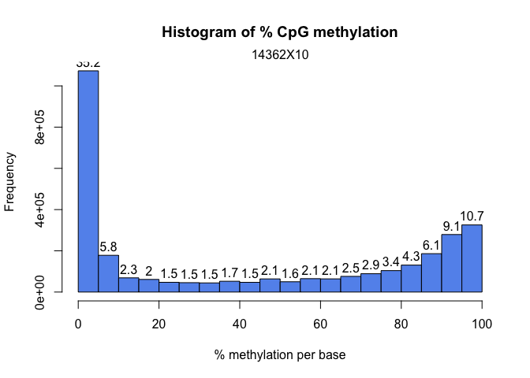
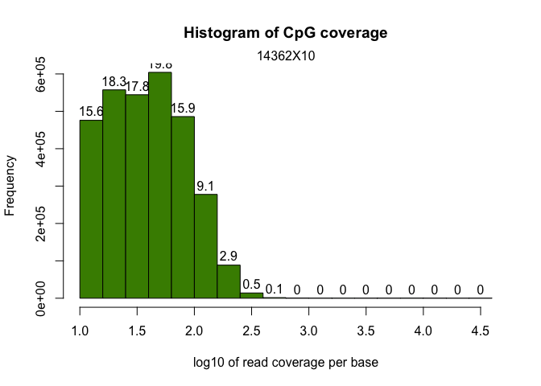
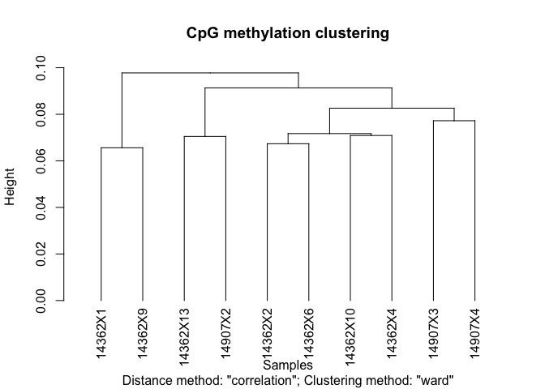
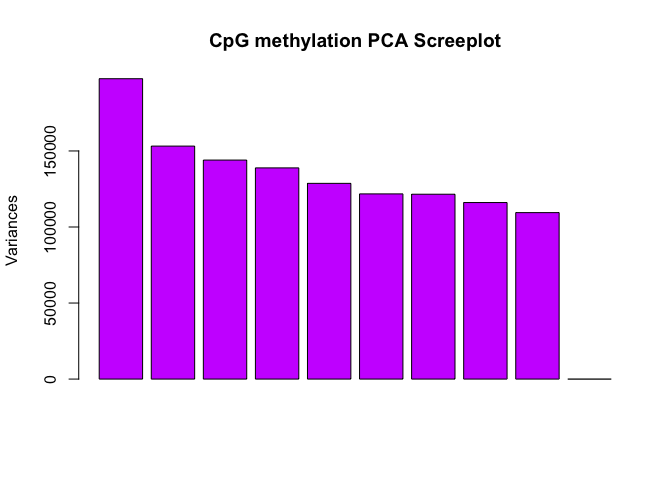
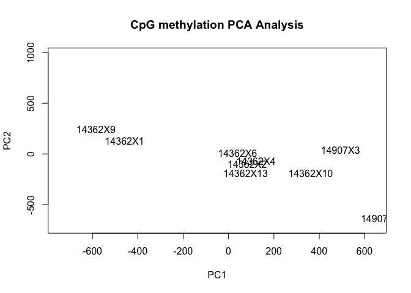
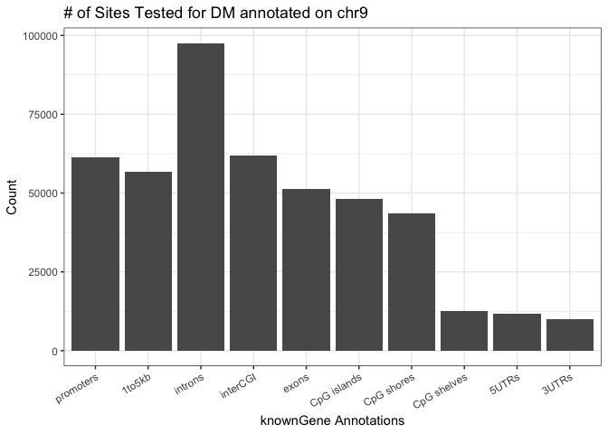
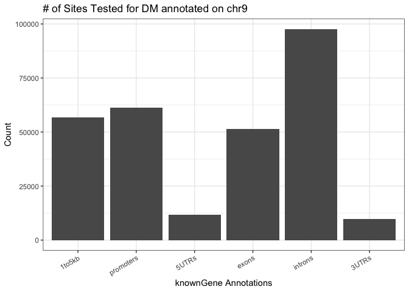
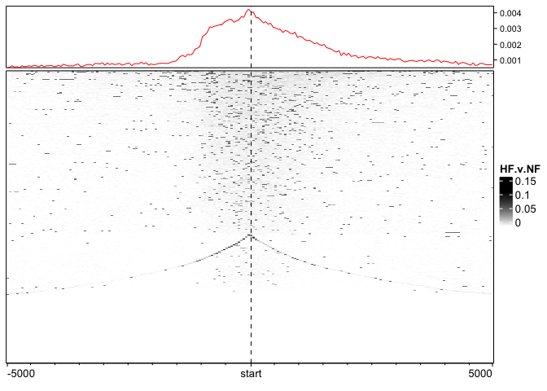
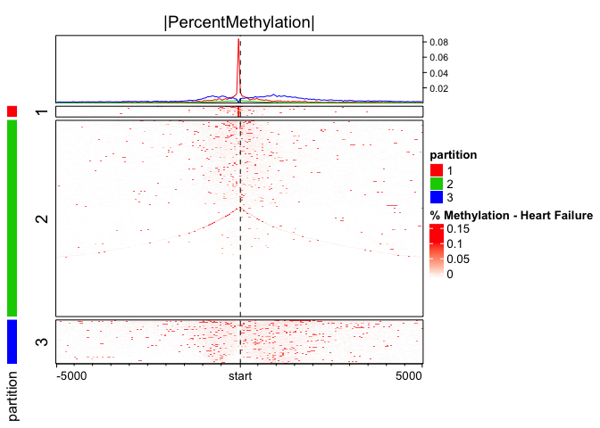

**Author**: Mark E. Pepin, MS Biomedical Engineering | MD/PhD Trainee  
**Contact**: pepinme@gmail.com  
**Institution**: University of Alabama at Birmingham  
**Location**: 542 Biomedical Research Building 2, Birmingham, AL 35294  

# Genome Assembly and Alignment

The first task is to align the bisulfite reduced and sequenced reads to a genome assembly. To accomplish this, I prepared the genome assembly based on Gencode annotation (gencode.v28.annotation.gtf) and sequence (GRCh38.p12.genome.fa). For whole-genome bisulfite sequencing via the Bismark (v0.20.0) aligner and genome preparation, a CT- and GA-converted assemblies are created.

## Genome Assembly

`./bismark_genome_preparation --path_to_bowtie ../bowtie2-2.3.4.2-linux-x86_64 -- verbose ../../Input/Genome/GRCh38.p12.genome.fa`

## Adapter Trimming

Once the genome assembly was created, adapter sequences were trimmed and sequencing quality assessed via trim_galore and FastQC, respectively.

`module load SAMtools/1.6-intel-2017a`
`module load Bowtie2/2.3.3-intel-2017a`
`module load Trim_Galore/0.4.4-foss-2016b`
`module load FastQC/0.11.7-Java-1.8.0_74`

`trim_galore -o $INPUT_DIR/fastq_trimmed/ --paired --rrbs --non_directional --length 20 --fastqc` `$INPUT_DIR/fastq/${VAR}_1.txt.gz $INPUT_DIR/fastq/${VAR}_2.txt.gz`

## Read Alignment

We then aligned all 34 paired-end .fastq files to the genome assemblies using the following command:

`$BISMARK/bismark \`
`--bowtie2 --bam $GENOME_DIR \`
`-1 $INPUT_DIR/fastq_trimmed/${VAR}_1.txt.gz_val_1.fq.gz -2 $INPUT_DIR/fastq_trimmed/${VAR}_2.txt.gz_val_2.fq.gz \`
`--output_dir $RESULTS_DIR/WGBS`

## Deduplication

Once aligned, we need to "deduplicate" the aligned .bam files to reduce PCR bias.

`$BISMARK/deduplicate_bismark \`
`--output_dir $RESULTS_DIR/WGBS/deduplicate_bismark \`
`--bam -p \`
`$RESULTS_DIR/WGBS/${VAR}_1.txt.gz_val_1_bismark_bt2_pe.bam`

## Methylation Extraction

Once finished, the CpG methylation was extracted as both bedgraph file (for UCSC genome browser) and bed file, which was then used to identify differentially-methylated cytosines (DMCs) and differentially-methylated regions (DMRs).

`$BISMARK/bismark_methylation_extractor \`
`-p --no_overlap --report --bedGraph --gzip \`
`$RESULTS_DIR/WGBS/deduplicate_bismark/${VAR}_1.txt.gz_val_1_bismark_bt2_pe.deduplicated.bam`

The "bismark.cov" files that resulted from this were then read into R () and combined into a single "object" for differential methylation analysis

# Differential Methylation Analysis

## Combining sample methylation


```r
#Conditions to be used in differential methylation analysis (FILL OUT)
library(openxlsx)
RESPONSE=c("CON","NR")
TIMING=c("CON","Pre")

ANALYSIS="HF.v.NF"
### "2" is Pre-LVAD, "3" is Post-LVAD, "1" is CON
library(methylKit)
file.list <- list.files(path = "../2_Input/2_Methyl/Aligned", pattern = "*_1.txt.gz_val_1_bismark_bt2_pe.deduplicated.bismark.cov", full.names = TRUE, all.files = TRUE)
#Generate Column names (remove the extra nonsense from the path names)
colnames <- gsub( "*_1.txt.gz_val_1_bismark_bt2_pe.deduplicated.bismark.cov", "", file.list)
colnames <- gsub( "[.][.]/2_Input/2_Methyl/Aligned/", "", colnames)
colnames <- gsub("\\_.*", "", colnames)
sample_id<-as.list(colnames)
#Import the Index file
Index.raw<-read.xlsx("../2_Input/_Patient/Index_no.outliers.xlsx", sheet = "Index_no.outliers")
Index.raw$Timing<-factor(Index.raw$Timing, levels = c("CON", "Pre", "Post"))
Index.raw$Response<-factor(Index.raw$Response, levels=c("CON", "NR", "R"))
Index.raw$Etiology<-factor(Index.raw$Etiology, levels=c("CON", "NICM", "ICM"))
Index.raw$Pairing<-as.character(Index.raw$Pairing)

## Sort the index according to the .bed file ordering (as imported). This is important for correct annotation of samples.
Index_sorted<-subset(Index.raw, DNA.Meth_ID %in% colnames)
Index_sorted$DNA.meth.ID<-factor(Index_sorted$DNA.Meth_ID, levels = colnames)
Index_sorted<-Index_sorted[order(Index_sorted$DNA.Meth_ID),]
#Created an index based on the desired sample criteria (Phenotype and Timing)
Index_filtered<-subset(Index_sorted, Response %in% RESPONSE & Timing %in% TIMING)
##Change "Pre/Post" variable to a factor of "0" or "1" (needed for differential methylation)
Index_sorted$Timing<-factor(Index_sorted$Timing, levels = c("CON", "Pre", "Post"))
Index_sorted$Timing<-as.integer(Index_sorted$Timing)

Index_sorted$Response<-factor(Index_sorted$Response, levels = c("CON", "NR", "R"))
Index_sorted$Response<-as.integer(Index_sorted$Response)
# Index_sorted<-Index_sorted[!is.na(Index_sorted$Timing),]
##Create a methlRawlistDB
file.list<-as.list(file.list)
myobj<-methRead(file.list, sample.id = sample_id, assembly = "hg38", treatment = Index_sorted$Response, pipeline = "bismarkCoverage", header = FALSE, context = "CpG")
##Example of smaple statistics (can spot check these)
getMethylationStats(myobj[[3]], plot = F, both.strands = F)
```

```
## methylation statistics per base
## summary:
##    Min. 1st Qu.  Median    Mean 3rd Qu.    Max. 
##   0.000   1.639  37.963  43.351  86.486 100.000 
## percentiles:
##         0%        10%        20%        30%        40%        50% 
##   0.000000   0.000000   0.000000   3.076923  10.000000  37.962963 
##        60%        70%        80%        90%        95%        99% 
##  64.705882  81.318681  90.243902  95.454545  98.245614 100.000000 
##      99.5%      99.9%       100% 
## 100.000000 100.000000 100.000000
```

```r
#Subset the methylRawList to include only the sample_id's for the desired analysis
myobj_filtered<-reorganize(myobj, sample.ids = Index_filtered$DNA.Meth_ID, Index_filtered$Response)
```

Once the samples have been compiled, it is valuable to perform some basic visualizations and statistics to determine whether quality filtering is necessary. The distribution of methylation change is plotted as a histogram (typically bimodal at the extremes), as well as a distribution of the read coverage per based, again plotted as a histogram. For the latter plot, it is important to determine whether PCR duplication biases the read coverage. If so, a secondary peak would emerge on the right-most portion of the histogram. In the current analysis, coverage distribution exhibits a one-tailed distribution, suggesting that the "deduplication" step in the alignment effectively eliminated the PCR amplification bias in coverage.


```r
library(graphics)
getMethylationStats(myobj_filtered[[2]], plot = T, both.strands = F)
```

<!-- -->

```r
getCoverageStats(myobj_filtered[[2]], plot = T, both.strands = F)
```

<!-- -->

```r
#Save these files in an output folder
ifelse(!dir.exists(file.path("../3_Output/", ANALYSIS)), dir.create(file.path("../3_Output/", ANALYSIS)), FALSE)
```

```
## [1] FALSE
```

```r
pdf(file=paste0("../3_Output/", ANALYSIS, "/", ANALYSIS, "_Methylation.Stats.pdf"))
getMethylationStats(myobj_filtered[[2]], plot = T, both.strands = F)
dev.off()
```

```
## quartz_off_screen 
##                 2
```

```r
pdf(file=paste0("../3_Output/", ANALYSIS, "/", ANALYSIS, "_Coverage.Stats.pdf"))
getCoverageStats(myobj_filtered[[2]], plot = T, both.strands = F)
dev.off()
```

```
## quartz_off_screen 
##                 2
```

Although most important in the context of correcting PCR-bias (duplication), filtering samples based on coverage also reduces false discovery based on low-coverage genomic regions. If PCR bias exists, an artificially high coverage would exist. Low coverage is also a concern due to low statistical power associated with low-coverage regions. Below, we discard bases with coverage below 10X, but also discard bases with coverage > 99.9th percentile.


```r
#remove exceedingly high-coverage (risk of PCR bias) or low-coverage DMPs (low statistical power) 
filtered.myobj <- filterByCoverage(myobj_filtered, lo.count = 10, lo.perc = NULL, hi.count = NULL, hi.perc = 99.9)
```

##Visualizing Methylation


```r
#destrand and unite the sample data
meth<-unite(filtered.myobj, destrand = FALSE) #When calculating DMRs, it is not helpful to "destrand"
clusterSamples(meth, dist = "correlation", method = "ward", plot = TRUE)
```

<!-- -->

```
## 
## Call:
## hclust(d = d, method = HCLUST.METHODS[hclust.method])
## 
## Cluster method   : ward.D 
## Distance         : pearson 
## Number of objects: 10
```

```r
PCASamples(meth, screeplot = TRUE)
```

<!-- -->

```r
PCASamples(meth)
```

<!-- -->

```r
#Create a folder in which to generate all documents/tables for this analysyis
ifelse(!dir.exists(file.path("../3_Output/", ANALYSIS)), dir.create(file.path("../3_Output/", ANALYSIS)), FALSE)
```

```
## [1] FALSE
```

```r
#Create dendrogram and PCA plots
pdf(file=paste0("../3_Output/", ANALYSIS, "/", ANALYSIS, "_Clustering.pdf"))
clusterSamples(meth, dist = "correlation", method = "ward", plot = TRUE)
```

```
## 
## Call:
## hclust(d = d, method = HCLUST.METHODS[hclust.method])
## 
## Cluster method   : ward.D 
## Distance         : pearson 
## Number of objects: 10
```

```r
PCASamples(meth, screeplot = TRUE)
PCASamples(meth)
dev.off()
```

```
## quartz_off_screen 
##                 2
```


## Differentially-Methylated Cytosines (DMCs)


```r
#Calculate the differential methylation (TAKES A LONG TIME!)
library(openxlsx)
myDiff<-calculateDiffMeth(meth, overdispersion = "MN", test = "Chisq", mc.cores = 7)
myDiff_md<-as(myDiff,"methylDiff")
myDiff_filtered<-dplyr::select(myDiff_md, chr, start, end, strand, meth.diff, pvalue, qvalue)

#Calculate percent methylation for each sample/site
Methylation<-as.data.frame(meth)
f = function(Cyt, cov, col_name) {
  require(lazyeval)
  require(dplyr)
    mutate_call = lazyeval::interp(~ (a / b)*100, a = as.name(Cyt), b = as.name(cov))
    Methylation %>% mutate_(.dots = setNames(list(mutate_call), col_name))
}
for(i in seq_along(Index_filtered$DNA.Meth_ID)){
  COVERAGE=paste0("coverage", i)
  mC=paste0("numCs", i)
  perc.mC=paste0("perc.mC_", Index_filtered$DNA.Meth_ID[i])
  Methylation<-f(Cyt=mC, cov=COVERAGE, col_name=perc.mC)
}
Methylation<-dplyr::select(Methylation, chr, start, end, contains("perc.mC"))

#Merge with the percent methylation (by cytosine)
myDiff_filtered<-left_join(myDiff_filtered, Methylation)

#Subset by statistical threshold
myDiff_p05<-dplyr::filter(myDiff_filtered, pvalue<0.05)
myDiff_q05<-dplyr::filter(myDiff_filtered, qvalue<0.05)

#Save a copy of the differential Methylation analysis
wb_countData<-createWorkbook()
addWorksheet(wb_countData, "P < 0.05")
  writeData(wb_countData, "P < 0.05", myDiff_p05, rowNames = F)
addWorksheet(wb_countData, "Q < 0.05")
  writeData(wb_countData, "Q < 0.05", myDiff_q05, rowNames = F)
saveWorkbook(wb_countData, file = paste0("../3_Output/", ANALYSIS, "/", ANALYSIS, "_DiffMeth.xlsx"), overwrite = TRUE)
write.table(myDiff_p05, file=paste0("../3_Output/", ANALYSIS, "/", ANALYSIS, "_DiffMeth.bed"), quote=F, sep="\t", row.names=F, col.names=F)
```

## Annotate DMPs with Genomic and CpG Loci


```r
library(openxlsx)
library(annotatr)
library(AnnotationHub)
library(rtracklayer)
library(TxDb.Hsapiens.UCSC.hg38.knownGene)

#convert to GRanges object (correct format for annotatr)
myDiff_p05_GR<-makeGRangesFromDataFrame(myDiff_p05, seqnames.field = "chr", strand.field="strand", start.field = "start", end.field = "end", keep.extra.columns = T)
#create annotations from the following sources
annots = c('hg38_cpgs', 'hg38_basicgenes')
# Build the annotations (a single GRanges object)
annotations = build_annotations(genome = 'hg38', annotations = annots)
# myDiff_GR<-as(myDiff, "GRanges")
# Intersect the regions read in with the annotations
dm_annotated = annotate_regions(
    regions = myDiff_p05_GR,
    annotations = annotations,
    ignore.strand = TRUE,
    quiet = FALSE)
#convert to a data.frame
df_dm_annotated = data.frame(dm_annotated)
# A GRanges object is returned
print(dm_annotated)
```

```
## GRanges object with 1123777 ranges and 14 metadata columns:
##             seqnames    ranges strand |         meth.diff
##                <Rle> <IRanges>  <Rle> |         <numeric>
##         [1]     chr1    629116      * |  24.6454673055515
##         [2]     chr1    629116      * |  24.6454673055515
##         [3]     chr1    629116      * |  24.6454673055515
##         [4]     chr1    629116      * |  24.6454673055515
##         [5]     chr1    629116      * |  24.6454673055515
##         ...      ...       ...    ... .               ...
##   [1123773]     chrX 155613303      * | -9.23270768161279
##   [1123774]     chrX 155613303      * | -9.23270768161279
##   [1123775]     chrX 155613303      * | -9.23270768161279
##   [1123776]     chrY  11332637      * | -25.5145682972467
##   [1123777]     chrY  11332637      * | -25.5145682972467
##                          pvalue            qvalue  perc.mC_14362X1
##                       <numeric>         <numeric>        <numeric>
##         [1]  0.0213191728665335 0.619668197783736 60.5263157894737
##         [2]  0.0213191728665335 0.619668197783736 60.5263157894737
##         [3]  0.0213191728665335 0.619668197783736 60.5263157894737
##         [4]  0.0213191728665335 0.619668197783736 60.5263157894737
##         [5]  0.0213191728665335 0.619668197783736 60.5263157894737
##         ...                 ...               ...              ...
##   [1123773]  0.0103176333771496 0.531249175577326 92.1052631578947
##   [1123774]  0.0103176333771496 0.531249175577326 92.1052631578947
##   [1123775]  0.0103176333771496 0.531249175577326 92.1052631578947
##   [1123776] 0.00356243772226756 0.391088667684166 31.5789473684211
##   [1123777] 0.00356243772226756 0.391088667684166 31.5789473684211
##             perc.mC_14362X10 perc.mC_14362X13  perc.mC_14362X2
##                    <numeric>        <numeric>        <numeric>
##         [1] 23.8095238095238 25.9259259259259 58.8235294117647
##         [2] 23.8095238095238 25.9259259259259 58.8235294117647
##         [3] 23.8095238095238 25.9259259259259 58.8235294117647
##         [4] 23.8095238095238 25.9259259259259 58.8235294117647
##         [5] 23.8095238095238 25.9259259259259 58.8235294117647
##         ...              ...              ...              ...
##   [1123773]  96.551724137931 80.1724137931034 85.7142857142857
##   [1123774]  96.551724137931 80.1724137931034 85.7142857142857
##   [1123775]  96.551724137931 80.1724137931034 85.7142857142857
##   [1123776] 38.4615384615385 41.9354838709677               50
##   [1123777] 38.4615384615385 41.9354838709677               50
##              perc.mC_14362X4  perc.mC_14362X6  perc.mC_14362X9
##                    <numeric>        <numeric>        <numeric>
##         [1] 56.4102564102564 59.4594594594595 23.5294117647059
##         [2] 56.4102564102564 59.4594594594595 23.5294117647059
##         [3] 56.4102564102564 59.4594594594595 23.5294117647059
##         [4] 56.4102564102564 59.4594594594595 23.5294117647059
##         [5] 56.4102564102564 59.4594594594595 23.5294117647059
##         ...              ...              ...              ...
##   [1123773]               80 78.3783783783784 77.0833333333333
##   [1123774]               80 78.3783783783784 77.0833333333333
##   [1123775]               80 78.3783783783784 77.0833333333333
##   [1123776]           46.875 36.3636363636364               65
##   [1123777]           46.875 36.3636363636364               65
##              perc.mC_14907X2  perc.mC_14907X3  perc.mC_14907X4
##                    <numeric>        <numeric>        <numeric>
##         [1] 21.4285714285714 34.1463414634146 10.7142857142857
##         [2] 21.4285714285714 34.1463414634146 10.7142857142857
##         [3] 21.4285714285714 34.1463414634146 10.7142857142857
##         [4] 21.4285714285714 34.1463414634146 10.7142857142857
##         [5] 21.4285714285714 34.1463414634146 10.7142857142857
##         ...              ...              ...              ...
##   [1123773] 91.1392405063291             92.5 94.4444444444444
##   [1123774] 91.1392405063291             92.5 94.4444444444444
##   [1123775] 91.1392405063291             92.5 94.4444444444444
##   [1123776] 63.6363636363636 61.1111111111111 85.7142857142857
##   [1123777] 63.6363636363636 61.1111111111111 85.7142857142857
##                                  annot
##                              <GRanges>
##         [1]       chr1:629009-630008:-
##         [2]       chr1:629011-630010:-
##         [3]       chr1:625896-629895:+
##         [4]       chr1:601578-711710:-
##         [5]       chr1:608057-698926:-
##         ...                        ...
##   [1123773] chrX:155612896-155613895:-
##   [1123774] chrX:155545278-155669757:-
##   [1123775] chrX:155613059-155615058:*
##   [1123776]   chrY:11328688-11332687:+
##   [1123777]   chrY:11332328-11333652:*
##   -------
##   seqinfo: 93 sequences from an unspecified genome; no seqlengths
```

```r
##The issue with this annotation is that each DMP has multiple repeated rows if different annotations. To simplify this, we can condense the annotations into strings. This makes the resulting file more manageable based on the differential-methylation data.
DiffMeth_Annotated<-df_dm_annotated %>% 
  tidyr::fill(annot.symbol) %>% distinct() %>%
  dplyr::group_by(seqnames, start, end, meth.diff, pvalue, qvalue, annot.symbol) %>% 
  dplyr::summarise(Annotation=paste(unique(annot.type), collapse = ";"), Test=paste(unique(annot.id), collapse = ";"))
#Add %Methylation
DiffMeth_Annotated<-dplyr::rename(DiffMeth_Annotated, chr=seqnames)
DiffMeth_Annotated<-dplyr::left_join(DiffMeth_Annotated, Methylation)
#subset the Differential Methylation by statistics
DiffMeth_Annotated_p05<-subset(DiffMeth_Annotated, pvalue<0.05)
DiffMeth_Annotated_q05<-subset(DiffMeth_Annotated, qvalue<0.05)
#Write out the annotated DMP file 
library(openxlsx)
ifelse(!dir.exists(file.path("../3_Output/", ANALYSIS)), dir.create(file.path("../3_Output/", ANALYSIS)), FALSE)
```

```
## [1] FALSE
```

```r
wb_WGBS_Annotate<-createWorkbook()
addWorksheet(wb_WGBS_Annotate, "P < 0.05")
  writeData(wb_WGBS_Annotate, "P < 0.05", DiffMeth_Annotated_p05, rowNames = F)
addWorksheet(wb_WGBS_Annotate, "Q < 0.05")
  writeData(wb_WGBS_Annotate, "Q < 0.05", DiffMeth_Annotated_q05, rowNames = F)
saveWorkbook(wb_WGBS_Annotate, file = paste0("../3_Output/", ANALYSIS, "/", ANALYSIS, "_Annotated_DiffMeth.xlsx"), overwrite = TRUE)
#Provide a summary of the annotation
dm_annsum = summarize_annotations(
    annotated_regions = dm_annotated,
    quiet = TRUE)
print(dm_annsum)
```

```
## # A tibble: 10 x 2
##    annot.type               n
##    <chr>                <int>
##  1 hg38_cpg_inter       61984
##  2 hg38_cpg_islands     48199
##  3 hg38_cpg_shelves     12691
##  4 hg38_cpg_shores      43617
##  5 hg38_genes_1to5kb    56694
##  6 hg38_genes_3UTRs      9846
##  7 hg38_genes_5UTRs     11590
##  8 hg38_genes_exons     51351
##  9 hg38_genes_introns   97600
## 10 hg38_genes_promoters 61366
```

```r
#Plot the annotation distribution
dm_vs_kg_annotations = plot_annotation(
    annotated_regions = dm_annotated,
    plot_title = '# of Sites Tested for DM annotated on chr9',
    x_label = 'knownGene Annotations',
    y_label = 'Count')
print(dm_vs_kg_annotations)
```

<!-- -->

```r
annots_order = c(
    'hg38_genes_1to5kb',
    'hg38_genes_promoters',
    'hg38_genes_5UTRs',
    'hg38_genes_exons',
    'hg38_genes_introns',
    'hg38_genes_3UTRs')
dm_vs_kg_annotations = plot_annotation(
    annotated_regions = dm_annotated,
    annotation_order = annots_order,
    plot_title = '# of Sites Tested for DM annotated on chr9',
    x_label = 'knownGene Annotations',
    y_label = 'Count')
print(dm_vs_kg_annotations)
```

<!-- -->

#Heatmap of Differential Methylation


```r
library(pheatmap)
DiffMeth_hm<-dplyr::filter(DiffMeth_Annotated_p05, grepl("promoter", Annotation))
hm_Data<-as.data.frame(DiffMeth_hm)
hm_Data<-hm_Data[!is.na(hm_Data$annot.symbol),]
rownames(hm_Data)<-make.unique(hm_Data$annot.symbol, sep = ".")
hm_Data<-dplyr::filter(hm_Data)
##Make heatmap
STATISTIC=0.05
hm_Data<-dplyr::filter(hm_Data, qvalue<STATISTIC)

hm_Data<-dplyr::select(hm_Data, contains("perc.mC"))
hm_Data<-data.matrix(hm_Data)

##
##Index file for annotating samples
hm_Index<-Index_filtered
hm_Index$DNA.Meth_ID<-paste0("perc.mC_", hm_Index$DNA.Meth_ID)
rownames(hm_Index)<-hm_Index$DNA.Meth_ID
hm_Index<-as.data.frame(hm_Index)
hm_Index<-dplyr::select(hm_Index, Sample_ID, Timing, Age_yrs, Etiology, Sex, Race)

paletteLength <- 100
myColor <- colorRampPalette(c("dodgerblue4", "white", "gold2"))(paletteLength)
pheatmap(hm_Data,
         cluster_cols=T, 
         border_color=NA, 
         cluster_rows=T, 
         scale = 'row',
         show_colnames = T, 
         show_rownames = F, 
         color = myColor,
         annotation_col = hm_Index, 
         filename = paste0("../3_Output/", ANALYSIS, "/", ANALYSIS, "_Heatmap.Q05.pdf"))
```


# Methylation Distribution using **EnrichedHeatmap**


```r
#Import the genomic annotation file
library(EnrichedHeatmap)
library(annotatr)
library(TxDb.Hsapiens.UCSC.hg38.knownGene)
annots = c("hg38_basicgenes", "hg38_genes_promoters", "hg38_genes_intergenic",
           "hg38_genes_intronexonboundaries", "hg38_cpgs", "hg38_cpg_islands", "hg38_cpg_shores", "hg38_cpg_shelves", "hg38_cpg_inter")
annotations=build_annotations(genome = "hg38", annotations = annots)
annotations<-keepStandardChromosomes(annotations, pruning.mode = "coarse") #Remove nonstandard chromosomes

myDiff_p05<-dplyr::mutate(myDiff_p05, absolute.meth=abs(meth.diff))
myDiff_p05<-as(myDiff_p05, "GRanges")

meDiff<-as(myDiff, "GRanges")

# #Import the annotated "target" data
# myDiff<-openxlsx::read.xlsx(paste0("../2_Input/WGBS_MethylKit_DiffMeth", ANALYSIS,".xlsx"), sheet = "P < 0.05")
# myDiff_GR<-as(myDiff, "GRanges")

#Annotate GRanges using hg38 genome
dm_annotated = annotate_regions(
  regions = myDiff_p05,
  annotations = annotations,
  ignore.strand = TRUE)
#create data.frame
df_dm_annotated <- as.data.frame(dm_annotated)
#
library(GenomicFeatures)
genes<-genes(TxDb.Hsapiens.UCSC.hg38.knownGene)
tss = promoters(genes, upstream = 0, downstream = 1)
mat1 = normalizeToMatrix(myDiff_p05, tss, value_column = "absolute.meth", extend = 5000, mean_mode="w0", w=50, keep = c(0, 0.99))
EnrichedHeatmap(mat1, col = c("white", "black"), name = ANALYSIS)
```

<!-- -->

```r
png(file = paste0("../3_Output/", ANALYSIS, "/","_1Methyl.Gene.Distribution.png"), height = 3, width = 5)
EnrichedHeatmap(mat1, col = c("white", "black"), name = "Heart Failure")
dev.off()
```

```
## quartz_off_screen 
##                 2
```

```r
partition = kmeans(mat1, centers = 3)$cluster
lgd = Legend(at = c("cluster1", "cluster2", "cluster3"), title = "Clusters", 
    type = "lines", legend_gp = gpar(col = 2:4))
ht_list = Heatmap(partition, col = structure(2:4, names = as.character(1:3)), name = "partition",
              show_row_names = FALSE, width = unit(3, "mm")) + EnrichedHeatmap(mat1, col = c("white", "red"), name = "% Methylation - Heart Failure", split = partition, top_annotation = HeatmapAnnotation(lines = anno_enriched(gp = gpar(col = 2:4))), column_title = "|PercentMethylation|")
draw(ht_list, main_heatmap = "% Methylation - Heart Failure")
```

<!-- -->

```r
partition = kmeans(mat1, centers = 3)$cluster
lgd = Legend(at = c("cluster1", "cluster2", "cluster3"), title = "Clusters", 
    type = "lines", legend_gp = gpar(col = 2:4))
ht_list = Heatmap(partition, col = structure(2:4, names = as.character(1:3)), name = "partition",
              show_row_names = FALSE, width = unit(3, "mm")) + EnrichedHeatmap(mat1, col = c("white", "red"), name = "% Methylation - Heart Failure", split = partition, top_annotation = HeatmapAnnotation(lines = anno_enriched(gp = gpar(col = 2:4))), column_title = "|PercentMethylation|")
pdf(file = paste0("../3_Output/", ANALYSIS, "/", ANALYSIS, "_Methyl.Gene.Distribution_Kmeans.pdf"), height = 7, width = 5)
draw(ht_list, main_heatmap = "% Methylation - Heart Failure")
dev.off()
```

```
## quartz_off_screen 
##                 2
```


# Supplemental Table: R Session Information

All packages and setting are acquired using the following command: 

```r
sinfo<-devtools::session_info()
sinfo$platform
```

```
##  setting  value                       
##  version  R version 3.5.1 (2018-07-02)
##  os       macOS  10.14.1              
##  system   x86_64, darwin15.6.0        
##  ui       X11                         
##  language (EN)                        
##  collate  en_US.UTF-8                 
##  ctype    en_US.UTF-8                 
##  tz       America/Chicago             
##  date     2018-12-08
```

```r
sinfo$packages %>% kable( 
                         align="c", 
                         longtable=T, 
                         booktabs=T,
                         caption="Packages and Required Dependencies") %>% 
    kable_styling(latex_options=c("striped", "repeat_header", "condensed"))
```

<table class="table" style="margin-left: auto; margin-right: auto;">
<caption>Packages and Required Dependencies</caption>
 <thead>
  <tr>
   <th style="text-align:left;">   </th>
   <th style="text-align:center;"> package </th>
   <th style="text-align:center;"> ondiskversion </th>
   <th style="text-align:center;"> loadedversion </th>
   <th style="text-align:center;"> path </th>
   <th style="text-align:center;"> loadedpath </th>
   <th style="text-align:center;"> attached </th>
   <th style="text-align:center;"> is_base </th>
   <th style="text-align:center;"> date </th>
   <th style="text-align:center;"> source </th>
   <th style="text-align:center;"> md5ok </th>
   <th style="text-align:center;"> library </th>
  </tr>
 </thead>
<tbody>
  <tr>
   <td style="text-align:left;"> AnnotationDbi </td>
   <td style="text-align:center;"> AnnotationDbi </td>
   <td style="text-align:center;"> 1.44.0 </td>
   <td style="text-align:center;"> 1.44.0 </td>
   <td style="text-align:center;"> /Library/Frameworks/R.framework/Versions/3.5/Resources/library/AnnotationDbi </td>
   <td style="text-align:center;"> /Library/Frameworks/R.framework/Versions/3.5/Resources/library/AnnotationDbi </td>
   <td style="text-align:center;"> TRUE </td>
   <td style="text-align:center;"> FALSE </td>
   <td style="text-align:center;"> 2018-10-30 </td>
   <td style="text-align:center;"> Bioconductor </td>
   <td style="text-align:center;">  </td>
   <td style="text-align:center;"> /Library/Frameworks/R.framework/Versions/3.5/Resources/library </td>
  </tr>
  <tr>
   <td style="text-align:left;"> AnnotationHub </td>
   <td style="text-align:center;"> AnnotationHub </td>
   <td style="text-align:center;"> 2.14.1 </td>
   <td style="text-align:center;"> 2.14.1 </td>
   <td style="text-align:center;"> /Library/Frameworks/R.framework/Versions/3.5/Resources/library/AnnotationHub </td>
   <td style="text-align:center;"> /Library/Frameworks/R.framework/Versions/3.5/Resources/library/AnnotationHub </td>
   <td style="text-align:center;"> TRUE </td>
   <td style="text-align:center;"> FALSE </td>
   <td style="text-align:center;"> 2018-11-05 </td>
   <td style="text-align:center;"> Bioconductor </td>
   <td style="text-align:center;">  </td>
   <td style="text-align:center;"> /Library/Frameworks/R.framework/Versions/3.5/Resources/library </td>
  </tr>
  <tr>
   <td style="text-align:left;"> annotatr </td>
   <td style="text-align:center;"> annotatr </td>
   <td style="text-align:center;"> 1.8.0 </td>
   <td style="text-align:center;"> 1.8.0 </td>
   <td style="text-align:center;"> /Library/Frameworks/R.framework/Versions/3.5/Resources/library/annotatr </td>
   <td style="text-align:center;"> /Library/Frameworks/R.framework/Versions/3.5/Resources/library/annotatr </td>
   <td style="text-align:center;"> TRUE </td>
   <td style="text-align:center;"> FALSE </td>
   <td style="text-align:center;"> 2018-10-30 </td>
   <td style="text-align:center;"> Bioconductor </td>
   <td style="text-align:center;">  </td>
   <td style="text-align:center;"> /Library/Frameworks/R.framework/Versions/3.5/Resources/library </td>
  </tr>
  <tr>
   <td style="text-align:left;"> assertthat </td>
   <td style="text-align:center;"> assertthat </td>
   <td style="text-align:center;"> 0.2.0 </td>
   <td style="text-align:center;"> 0.2.0 </td>
   <td style="text-align:center;"> /Library/Frameworks/R.framework/Versions/3.5/Resources/library/assertthat </td>
   <td style="text-align:center;"> /Library/Frameworks/R.framework/Versions/3.5/Resources/library/assertthat </td>
   <td style="text-align:center;"> FALSE </td>
   <td style="text-align:center;"> FALSE </td>
   <td style="text-align:center;"> 2017-04-11 </td>
   <td style="text-align:center;"> CRAN (R 3.5.0) </td>
   <td style="text-align:center;">  </td>
   <td style="text-align:center;"> /Library/Frameworks/R.framework/Versions/3.5/Resources/library </td>
  </tr>
  <tr>
   <td style="text-align:left;"> backports </td>
   <td style="text-align:center;"> backports </td>
   <td style="text-align:center;"> 1.1.2 </td>
   <td style="text-align:center;"> 1.1.2 </td>
   <td style="text-align:center;"> /Library/Frameworks/R.framework/Versions/3.5/Resources/library/backports </td>
   <td style="text-align:center;"> /Library/Frameworks/R.framework/Versions/3.5/Resources/library/backports </td>
   <td style="text-align:center;"> FALSE </td>
   <td style="text-align:center;"> FALSE </td>
   <td style="text-align:center;"> 2017-12-13 </td>
   <td style="text-align:center;"> CRAN (R 3.5.0) </td>
   <td style="text-align:center;">  </td>
   <td style="text-align:center;"> /Library/Frameworks/R.framework/Versions/3.5/Resources/library </td>
  </tr>
  <tr>
   <td style="text-align:left;"> base64enc </td>
   <td style="text-align:center;"> base64enc </td>
   <td style="text-align:center;"> 0.1.3 </td>
   <td style="text-align:center;"> 0.1-3 </td>
   <td style="text-align:center;"> /Library/Frameworks/R.framework/Versions/3.5/Resources/library/base64enc </td>
   <td style="text-align:center;"> /Library/Frameworks/R.framework/Versions/3.5/Resources/library/base64enc </td>
   <td style="text-align:center;"> FALSE </td>
   <td style="text-align:center;"> FALSE </td>
   <td style="text-align:center;"> 2015-07-28 </td>
   <td style="text-align:center;"> CRAN (R 3.5.0) </td>
   <td style="text-align:center;">  </td>
   <td style="text-align:center;"> /Library/Frameworks/R.framework/Versions/3.5/Resources/library </td>
  </tr>
  <tr>
   <td style="text-align:left;"> bbmle </td>
   <td style="text-align:center;"> bbmle </td>
   <td style="text-align:center;"> 1.0.20 </td>
   <td style="text-align:center;"> 1.0.20 </td>
   <td style="text-align:center;"> /Library/Frameworks/R.framework/Versions/3.5/Resources/library/bbmle </td>
   <td style="text-align:center;"> /Library/Frameworks/R.framework/Versions/3.5/Resources/library/bbmle </td>
   <td style="text-align:center;"> FALSE </td>
   <td style="text-align:center;"> FALSE </td>
   <td style="text-align:center;"> 2017-10-30 </td>
   <td style="text-align:center;"> CRAN (R 3.5.0) </td>
   <td style="text-align:center;">  </td>
   <td style="text-align:center;"> /Library/Frameworks/R.framework/Versions/3.5/Resources/library </td>
  </tr>
  <tr>
   <td style="text-align:left;"> bindr </td>
   <td style="text-align:center;"> bindr </td>
   <td style="text-align:center;"> 0.1.1 </td>
   <td style="text-align:center;"> 0.1.1 </td>
   <td style="text-align:center;"> /Library/Frameworks/R.framework/Versions/3.5/Resources/library/bindr </td>
   <td style="text-align:center;"> /Library/Frameworks/R.framework/Versions/3.5/Resources/library/bindr </td>
   <td style="text-align:center;"> FALSE </td>
   <td style="text-align:center;"> FALSE </td>
   <td style="text-align:center;"> 2018-03-13 </td>
   <td style="text-align:center;"> CRAN (R 3.5.0) </td>
   <td style="text-align:center;">  </td>
   <td style="text-align:center;"> /Library/Frameworks/R.framework/Versions/3.5/Resources/library </td>
  </tr>
  <tr>
   <td style="text-align:left;"> bindrcpp </td>
   <td style="text-align:center;"> bindrcpp </td>
   <td style="text-align:center;"> 0.2.2 </td>
   <td style="text-align:center;"> 0.2.2 </td>
   <td style="text-align:center;"> /Library/Frameworks/R.framework/Versions/3.5/Resources/library/bindrcpp </td>
   <td style="text-align:center;"> /Library/Frameworks/R.framework/Versions/3.5/Resources/library/bindrcpp </td>
   <td style="text-align:center;"> TRUE </td>
   <td style="text-align:center;"> FALSE </td>
   <td style="text-align:center;"> 2018-03-29 </td>
   <td style="text-align:center;"> CRAN (R 3.5.0) </td>
   <td style="text-align:center;">  </td>
   <td style="text-align:center;"> /Library/Frameworks/R.framework/Versions/3.5/Resources/library </td>
  </tr>
  <tr>
   <td style="text-align:left;"> Biobase </td>
   <td style="text-align:center;"> Biobase </td>
   <td style="text-align:center;"> 2.42.0 </td>
   <td style="text-align:center;"> 2.42.0 </td>
   <td style="text-align:center;"> /Library/Frameworks/R.framework/Versions/3.5/Resources/library/Biobase </td>
   <td style="text-align:center;"> /Library/Frameworks/R.framework/Versions/3.5/Resources/library/Biobase </td>
   <td style="text-align:center;"> TRUE </td>
   <td style="text-align:center;"> FALSE </td>
   <td style="text-align:center;"> 2018-10-30 </td>
   <td style="text-align:center;"> Bioconductor </td>
   <td style="text-align:center;">  </td>
   <td style="text-align:center;"> /Library/Frameworks/R.framework/Versions/3.5/Resources/library </td>
  </tr>
  <tr>
   <td style="text-align:left;"> BiocGenerics </td>
   <td style="text-align:center;"> BiocGenerics </td>
   <td style="text-align:center;"> 0.28.0 </td>
   <td style="text-align:center;"> 0.28.0 </td>
   <td style="text-align:center;"> /Library/Frameworks/R.framework/Versions/3.5/Resources/library/BiocGenerics </td>
   <td style="text-align:center;"> /Library/Frameworks/R.framework/Versions/3.5/Resources/library/BiocGenerics </td>
   <td style="text-align:center;"> TRUE </td>
   <td style="text-align:center;"> FALSE </td>
   <td style="text-align:center;"> 2018-10-30 </td>
   <td style="text-align:center;"> Bioconductor </td>
   <td style="text-align:center;">  </td>
   <td style="text-align:center;"> /Library/Frameworks/R.framework/Versions/3.5/Resources/library </td>
  </tr>
  <tr>
   <td style="text-align:left;"> BiocManager </td>
   <td style="text-align:center;"> BiocManager </td>
   <td style="text-align:center;"> 1.30.4 </td>
   <td style="text-align:center;"> 1.30.4 </td>
   <td style="text-align:center;"> /Library/Frameworks/R.framework/Versions/3.5/Resources/library/BiocManager </td>
   <td style="text-align:center;"> /Library/Frameworks/R.framework/Versions/3.5/Resources/library/BiocManager </td>
   <td style="text-align:center;"> FALSE </td>
   <td style="text-align:center;"> FALSE </td>
   <td style="text-align:center;"> 2018-11-13 </td>
   <td style="text-align:center;"> CRAN (R 3.5.1) </td>
   <td style="text-align:center;">  </td>
   <td style="text-align:center;"> /Library/Frameworks/R.framework/Versions/3.5/Resources/library </td>
  </tr>
  <tr>
   <td style="text-align:left;"> BiocParallel </td>
   <td style="text-align:center;"> BiocParallel </td>
   <td style="text-align:center;"> 1.16.0 </td>
   <td style="text-align:center;"> 1.16.0 </td>
   <td style="text-align:center;"> /Library/Frameworks/R.framework/Versions/3.5/Resources/library/BiocParallel </td>
   <td style="text-align:center;"> /Library/Frameworks/R.framework/Versions/3.5/Resources/library/BiocParallel </td>
   <td style="text-align:center;"> FALSE </td>
   <td style="text-align:center;"> FALSE </td>
   <td style="text-align:center;"> 2018-10-30 </td>
   <td style="text-align:center;"> Bioconductor </td>
   <td style="text-align:center;">  </td>
   <td style="text-align:center;"> /Library/Frameworks/R.framework/Versions/3.5/Resources/library </td>
  </tr>
  <tr>
   <td style="text-align:left;"> biomaRt </td>
   <td style="text-align:center;"> biomaRt </td>
   <td style="text-align:center;"> 2.38.0 </td>
   <td style="text-align:center;"> 2.38.0 </td>
   <td style="text-align:center;"> /Library/Frameworks/R.framework/Versions/3.5/Resources/library/biomaRt </td>
   <td style="text-align:center;"> /Library/Frameworks/R.framework/Versions/3.5/Resources/library/biomaRt </td>
   <td style="text-align:center;"> FALSE </td>
   <td style="text-align:center;"> FALSE </td>
   <td style="text-align:center;"> 2018-10-30 </td>
   <td style="text-align:center;"> Bioconductor </td>
   <td style="text-align:center;">  </td>
   <td style="text-align:center;"> /Library/Frameworks/R.framework/Versions/3.5/Resources/library </td>
  </tr>
  <tr>
   <td style="text-align:left;"> Biostrings </td>
   <td style="text-align:center;"> Biostrings </td>
   <td style="text-align:center;"> 2.50.1 </td>
   <td style="text-align:center;"> 2.50.1 </td>
   <td style="text-align:center;"> /Library/Frameworks/R.framework/Versions/3.5/Resources/library/Biostrings </td>
   <td style="text-align:center;"> /Library/Frameworks/R.framework/Versions/3.5/Resources/library/Biostrings </td>
   <td style="text-align:center;"> FALSE </td>
   <td style="text-align:center;"> FALSE </td>
   <td style="text-align:center;"> 2018-11-06 </td>
   <td style="text-align:center;"> Bioconductor </td>
   <td style="text-align:center;">  </td>
   <td style="text-align:center;"> /Library/Frameworks/R.framework/Versions/3.5/Resources/library </td>
  </tr>
  <tr>
   <td style="text-align:left;"> bit </td>
   <td style="text-align:center;"> bit </td>
   <td style="text-align:center;"> 1.1.14 </td>
   <td style="text-align:center;"> 1.1-14 </td>
   <td style="text-align:center;"> /Library/Frameworks/R.framework/Versions/3.5/Resources/library/bit </td>
   <td style="text-align:center;"> /Library/Frameworks/R.framework/Versions/3.5/Resources/library/bit </td>
   <td style="text-align:center;"> FALSE </td>
   <td style="text-align:center;"> FALSE </td>
   <td style="text-align:center;"> 2018-05-29 </td>
   <td style="text-align:center;"> CRAN (R 3.5.0) </td>
   <td style="text-align:center;">  </td>
   <td style="text-align:center;"> /Library/Frameworks/R.framework/Versions/3.5/Resources/library </td>
  </tr>
  <tr>
   <td style="text-align:left;"> bit64 </td>
   <td style="text-align:center;"> bit64 </td>
   <td style="text-align:center;"> 0.9.7 </td>
   <td style="text-align:center;"> 0.9-7 </td>
   <td style="text-align:center;"> /Library/Frameworks/R.framework/Versions/3.5/Resources/library/bit64 </td>
   <td style="text-align:center;"> /Library/Frameworks/R.framework/Versions/3.5/Resources/library/bit64 </td>
   <td style="text-align:center;"> FALSE </td>
   <td style="text-align:center;"> FALSE </td>
   <td style="text-align:center;"> 2017-05-08 </td>
   <td style="text-align:center;"> CRAN (R 3.5.0) </td>
   <td style="text-align:center;">  </td>
   <td style="text-align:center;"> /Library/Frameworks/R.framework/Versions/3.5/Resources/library </td>
  </tr>
  <tr>
   <td style="text-align:left;"> bitops </td>
   <td style="text-align:center;"> bitops </td>
   <td style="text-align:center;"> 1.0.6 </td>
   <td style="text-align:center;"> 1.0-6 </td>
   <td style="text-align:center;"> /Library/Frameworks/R.framework/Versions/3.5/Resources/library/bitops </td>
   <td style="text-align:center;"> /Library/Frameworks/R.framework/Versions/3.5/Resources/library/bitops </td>
   <td style="text-align:center;"> FALSE </td>
   <td style="text-align:center;"> FALSE </td>
   <td style="text-align:center;"> 2013-08-17 </td>
   <td style="text-align:center;"> CRAN (R 3.5.0) </td>
   <td style="text-align:center;">  </td>
   <td style="text-align:center;"> /Library/Frameworks/R.framework/Versions/3.5/Resources/library </td>
  </tr>
  <tr>
   <td style="text-align:left;"> blob </td>
   <td style="text-align:center;"> blob </td>
   <td style="text-align:center;"> 1.1.1 </td>
   <td style="text-align:center;"> 1.1.1 </td>
   <td style="text-align:center;"> /Library/Frameworks/R.framework/Versions/3.5/Resources/library/blob </td>
   <td style="text-align:center;"> /Library/Frameworks/R.framework/Versions/3.5/Resources/library/blob </td>
   <td style="text-align:center;"> FALSE </td>
   <td style="text-align:center;"> FALSE </td>
   <td style="text-align:center;"> 2018-03-25 </td>
   <td style="text-align:center;"> CRAN (R 3.5.0) </td>
   <td style="text-align:center;">  </td>
   <td style="text-align:center;"> /Library/Frameworks/R.framework/Versions/3.5/Resources/library </td>
  </tr>
  <tr>
   <td style="text-align:left;"> BSgenome </td>
   <td style="text-align:center;"> BSgenome </td>
   <td style="text-align:center;"> 1.50.0 </td>
   <td style="text-align:center;"> 1.50.0 </td>
   <td style="text-align:center;"> /Library/Frameworks/R.framework/Versions/3.5/Resources/library/BSgenome </td>
   <td style="text-align:center;"> /Library/Frameworks/R.framework/Versions/3.5/Resources/library/BSgenome </td>
   <td style="text-align:center;"> FALSE </td>
   <td style="text-align:center;"> FALSE </td>
   <td style="text-align:center;"> 2018-10-30 </td>
   <td style="text-align:center;"> Bioconductor </td>
   <td style="text-align:center;">  </td>
   <td style="text-align:center;"> /Library/Frameworks/R.framework/Versions/3.5/Resources/library </td>
  </tr>
  <tr>
   <td style="text-align:left;"> callr </td>
   <td style="text-align:center;"> callr </td>
   <td style="text-align:center;"> 3.0.0 </td>
   <td style="text-align:center;"> 3.0.0 </td>
   <td style="text-align:center;"> /Library/Frameworks/R.framework/Versions/3.5/Resources/library/callr </td>
   <td style="text-align:center;"> /Library/Frameworks/R.framework/Versions/3.5/Resources/library/callr </td>
   <td style="text-align:center;"> FALSE </td>
   <td style="text-align:center;"> FALSE </td>
   <td style="text-align:center;"> 2018-08-24 </td>
   <td style="text-align:center;"> CRAN (R 3.5.0) </td>
   <td style="text-align:center;">  </td>
   <td style="text-align:center;"> /Library/Frameworks/R.framework/Versions/3.5/Resources/library </td>
  </tr>
  <tr>
   <td style="text-align:left;"> circlize </td>
   <td style="text-align:center;"> circlize </td>
   <td style="text-align:center;"> 0.4.5 </td>
   <td style="text-align:center;"> 0.4.5 </td>
   <td style="text-align:center;"> /Library/Frameworks/R.framework/Versions/3.5/Resources/library/circlize </td>
   <td style="text-align:center;"> /Library/Frameworks/R.framework/Versions/3.5/Resources/library/circlize </td>
   <td style="text-align:center;"> FALSE </td>
   <td style="text-align:center;"> FALSE </td>
   <td style="text-align:center;"> 2018-11-21 </td>
   <td style="text-align:center;"> CRAN (R 3.5.1) </td>
   <td style="text-align:center;">  </td>
   <td style="text-align:center;"> /Library/Frameworks/R.framework/Versions/3.5/Resources/library </td>
  </tr>
  <tr>
   <td style="text-align:left;"> cli </td>
   <td style="text-align:center;"> cli </td>
   <td style="text-align:center;"> 1.0.1 </td>
   <td style="text-align:center;"> 1.0.1 </td>
   <td style="text-align:center;"> /Library/Frameworks/R.framework/Versions/3.5/Resources/library/cli </td>
   <td style="text-align:center;"> /Library/Frameworks/R.framework/Versions/3.5/Resources/library/cli </td>
   <td style="text-align:center;"> FALSE </td>
   <td style="text-align:center;"> FALSE </td>
   <td style="text-align:center;"> 2018-09-25 </td>
   <td style="text-align:center;"> CRAN (R 3.5.0) </td>
   <td style="text-align:center;">  </td>
   <td style="text-align:center;"> /Library/Frameworks/R.framework/Versions/3.5/Resources/library </td>
  </tr>
  <tr>
   <td style="text-align:left;"> coda </td>
   <td style="text-align:center;"> coda </td>
   <td style="text-align:center;"> 0.19.2 </td>
   <td style="text-align:center;"> 0.19-2 </td>
   <td style="text-align:center;"> /Library/Frameworks/R.framework/Versions/3.5/Resources/library/coda </td>
   <td style="text-align:center;"> /Library/Frameworks/R.framework/Versions/3.5/Resources/library/coda </td>
   <td style="text-align:center;"> FALSE </td>
   <td style="text-align:center;"> FALSE </td>
   <td style="text-align:center;"> 2018-10-08 </td>
   <td style="text-align:center;"> CRAN (R 3.5.0) </td>
   <td style="text-align:center;">  </td>
   <td style="text-align:center;"> /Library/Frameworks/R.framework/Versions/3.5/Resources/library </td>
  </tr>
  <tr>
   <td style="text-align:left;"> codetools </td>
   <td style="text-align:center;"> codetools </td>
   <td style="text-align:center;"> 0.2.15 </td>
   <td style="text-align:center;"> 0.2-15 </td>
   <td style="text-align:center;"> /Library/Frameworks/R.framework/Versions/3.5/Resources/library/codetools </td>
   <td style="text-align:center;"> /Library/Frameworks/R.framework/Versions/3.5/Resources/library/codetools </td>
   <td style="text-align:center;"> FALSE </td>
   <td style="text-align:center;"> FALSE </td>
   <td style="text-align:center;"> 2016-10-05 </td>
   <td style="text-align:center;"> CRAN (R 3.5.1) </td>
   <td style="text-align:center;">  </td>
   <td style="text-align:center;"> /Library/Frameworks/R.framework/Versions/3.5/Resources/library </td>
  </tr>
  <tr>
   <td style="text-align:left;"> colorspace </td>
   <td style="text-align:center;"> colorspace </td>
   <td style="text-align:center;"> 1.3.2 </td>
   <td style="text-align:center;"> 1.3-2 </td>
   <td style="text-align:center;"> /Library/Frameworks/R.framework/Versions/3.5/Resources/library/colorspace </td>
   <td style="text-align:center;"> /Library/Frameworks/R.framework/Versions/3.5/Resources/library/colorspace </td>
   <td style="text-align:center;"> FALSE </td>
   <td style="text-align:center;"> FALSE </td>
   <td style="text-align:center;"> 2016-12-14 </td>
   <td style="text-align:center;"> CRAN (R 3.5.0) </td>
   <td style="text-align:center;">  </td>
   <td style="text-align:center;"> /Library/Frameworks/R.framework/Versions/3.5/Resources/library </td>
  </tr>
  <tr>
   <td style="text-align:left;"> ComplexHeatmap </td>
   <td style="text-align:center;"> ComplexHeatmap </td>
   <td style="text-align:center;"> 1.20.0 </td>
   <td style="text-align:center;"> 1.20.0 </td>
   <td style="text-align:center;"> /Library/Frameworks/R.framework/Versions/3.5/Resources/library/ComplexHeatmap </td>
   <td style="text-align:center;"> /Library/Frameworks/R.framework/Versions/3.5/Resources/library/ComplexHeatmap </td>
   <td style="text-align:center;"> TRUE </td>
   <td style="text-align:center;"> FALSE </td>
   <td style="text-align:center;"> 2018-10-30 </td>
   <td style="text-align:center;"> Bioconductor </td>
   <td style="text-align:center;">  </td>
   <td style="text-align:center;"> /Library/Frameworks/R.framework/Versions/3.5/Resources/library </td>
  </tr>
  <tr>
   <td style="text-align:left;"> crayon </td>
   <td style="text-align:center;"> crayon </td>
   <td style="text-align:center;"> 1.3.4 </td>
   <td style="text-align:center;"> 1.3.4 </td>
   <td style="text-align:center;"> /Library/Frameworks/R.framework/Versions/3.5/Resources/library/crayon </td>
   <td style="text-align:center;"> /Library/Frameworks/R.framework/Versions/3.5/Resources/library/crayon </td>
   <td style="text-align:center;"> FALSE </td>
   <td style="text-align:center;"> FALSE </td>
   <td style="text-align:center;"> 2017-09-16 </td>
   <td style="text-align:center;"> CRAN (R 3.5.0) </td>
   <td style="text-align:center;">  </td>
   <td style="text-align:center;"> /Library/Frameworks/R.framework/Versions/3.5/Resources/library </td>
  </tr>
  <tr>
   <td style="text-align:left;"> curl </td>
   <td style="text-align:center;"> curl </td>
   <td style="text-align:center;"> 3.2 </td>
   <td style="text-align:center;"> 3.2 </td>
   <td style="text-align:center;"> /Library/Frameworks/R.framework/Versions/3.5/Resources/library/curl </td>
   <td style="text-align:center;"> /Library/Frameworks/R.framework/Versions/3.5/Resources/library/curl </td>
   <td style="text-align:center;"> FALSE </td>
   <td style="text-align:center;"> FALSE </td>
   <td style="text-align:center;"> 2018-03-28 </td>
   <td style="text-align:center;"> CRAN (R 3.5.0) </td>
   <td style="text-align:center;">  </td>
   <td style="text-align:center;"> /Library/Frameworks/R.framework/Versions/3.5/Resources/library </td>
  </tr>
  <tr>
   <td style="text-align:left;"> data.table </td>
   <td style="text-align:center;"> data.table </td>
   <td style="text-align:center;"> 1.11.8 </td>
   <td style="text-align:center;"> 1.11.8 </td>
   <td style="text-align:center;"> /Library/Frameworks/R.framework/Versions/3.5/Resources/library/data.table </td>
   <td style="text-align:center;"> /Library/Frameworks/R.framework/Versions/3.5/Resources/library/data.table </td>
   <td style="text-align:center;"> FALSE </td>
   <td style="text-align:center;"> FALSE </td>
   <td style="text-align:center;"> 2018-09-30 </td>
   <td style="text-align:center;"> CRAN (R 3.5.0) </td>
   <td style="text-align:center;">  </td>
   <td style="text-align:center;"> /Library/Frameworks/R.framework/Versions/3.5/Resources/library </td>
  </tr>
  <tr>
   <td style="text-align:left;"> DBI </td>
   <td style="text-align:center;"> DBI </td>
   <td style="text-align:center;"> 1.0.0 </td>
   <td style="text-align:center;"> 1.0.0 </td>
   <td style="text-align:center;"> /Library/Frameworks/R.framework/Versions/3.5/Resources/library/DBI </td>
   <td style="text-align:center;"> /Library/Frameworks/R.framework/Versions/3.5/Resources/library/DBI </td>
   <td style="text-align:center;"> FALSE </td>
   <td style="text-align:center;"> FALSE </td>
   <td style="text-align:center;"> 2018-05-02 </td>
   <td style="text-align:center;"> CRAN (R 3.5.0) </td>
   <td style="text-align:center;">  </td>
   <td style="text-align:center;"> /Library/Frameworks/R.framework/Versions/3.5/Resources/library </td>
  </tr>
  <tr>
   <td style="text-align:left;"> DelayedArray </td>
   <td style="text-align:center;"> DelayedArray </td>
   <td style="text-align:center;"> 0.8.0 </td>
   <td style="text-align:center;"> 0.8.0 </td>
   <td style="text-align:center;"> /Library/Frameworks/R.framework/Versions/3.5/Resources/library/DelayedArray </td>
   <td style="text-align:center;"> /Library/Frameworks/R.framework/Versions/3.5/Resources/library/DelayedArray </td>
   <td style="text-align:center;"> FALSE </td>
   <td style="text-align:center;"> FALSE </td>
   <td style="text-align:center;"> 2018-10-30 </td>
   <td style="text-align:center;"> Bioconductor </td>
   <td style="text-align:center;">  </td>
   <td style="text-align:center;"> /Library/Frameworks/R.framework/Versions/3.5/Resources/library </td>
  </tr>
  <tr>
   <td style="text-align:left;"> desc </td>
   <td style="text-align:center;"> desc </td>
   <td style="text-align:center;"> 1.2.0 </td>
   <td style="text-align:center;"> 1.2.0 </td>
   <td style="text-align:center;"> /Library/Frameworks/R.framework/Versions/3.5/Resources/library/desc </td>
   <td style="text-align:center;"> /Library/Frameworks/R.framework/Versions/3.5/Resources/library/desc </td>
   <td style="text-align:center;"> FALSE </td>
   <td style="text-align:center;"> FALSE </td>
   <td style="text-align:center;"> 2018-05-01 </td>
   <td style="text-align:center;"> CRAN (R 3.5.0) </td>
   <td style="text-align:center;">  </td>
   <td style="text-align:center;"> /Library/Frameworks/R.framework/Versions/3.5/Resources/library </td>
  </tr>
  <tr>
   <td style="text-align:left;"> devtools </td>
   <td style="text-align:center;"> devtools </td>
   <td style="text-align:center;"> 2.0.1 </td>
   <td style="text-align:center;"> 2.0.1 </td>
   <td style="text-align:center;"> /Library/Frameworks/R.framework/Versions/3.5/Resources/library/devtools </td>
   <td style="text-align:center;"> /Library/Frameworks/R.framework/Versions/3.5/Resources/library/devtools </td>
   <td style="text-align:center;"> FALSE </td>
   <td style="text-align:center;"> FALSE </td>
   <td style="text-align:center;"> 2018-10-26 </td>
   <td style="text-align:center;"> CRAN (R 3.5.1) </td>
   <td style="text-align:center;">  </td>
   <td style="text-align:center;"> /Library/Frameworks/R.framework/Versions/3.5/Resources/library </td>
  </tr>
  <tr>
   <td style="text-align:left;"> digest </td>
   <td style="text-align:center;"> digest </td>
   <td style="text-align:center;"> 0.6.18 </td>
   <td style="text-align:center;"> 0.6.18 </td>
   <td style="text-align:center;"> /Library/Frameworks/R.framework/Versions/3.5/Resources/library/digest </td>
   <td style="text-align:center;"> /Library/Frameworks/R.framework/Versions/3.5/Resources/library/digest </td>
   <td style="text-align:center;"> FALSE </td>
   <td style="text-align:center;"> FALSE </td>
   <td style="text-align:center;"> 2018-10-10 </td>
   <td style="text-align:center;"> CRAN (R 3.5.0) </td>
   <td style="text-align:center;">  </td>
   <td style="text-align:center;"> /Library/Frameworks/R.framework/Versions/3.5/Resources/library </td>
  </tr>
  <tr>
   <td style="text-align:left;"> dplyr </td>
   <td style="text-align:center;"> dplyr </td>
   <td style="text-align:center;"> 0.7.8 </td>
   <td style="text-align:center;"> 0.7.8 </td>
   <td style="text-align:center;"> /Library/Frameworks/R.framework/Versions/3.5/Resources/library/dplyr </td>
   <td style="text-align:center;"> /Library/Frameworks/R.framework/Versions/3.5/Resources/library/dplyr </td>
   <td style="text-align:center;"> TRUE </td>
   <td style="text-align:center;"> FALSE </td>
   <td style="text-align:center;"> 2018-11-10 </td>
   <td style="text-align:center;"> CRAN (R 3.5.1) </td>
   <td style="text-align:center;">  </td>
   <td style="text-align:center;"> /Library/Frameworks/R.framework/Versions/3.5/Resources/library </td>
  </tr>
  <tr>
   <td style="text-align:left;"> emdbook </td>
   <td style="text-align:center;"> emdbook </td>
   <td style="text-align:center;"> 1.3.10 </td>
   <td style="text-align:center;"> 1.3.10 </td>
   <td style="text-align:center;"> /Library/Frameworks/R.framework/Versions/3.5/Resources/library/emdbook </td>
   <td style="text-align:center;"> /Library/Frameworks/R.framework/Versions/3.5/Resources/library/emdbook </td>
   <td style="text-align:center;"> FALSE </td>
   <td style="text-align:center;"> FALSE </td>
   <td style="text-align:center;"> 2018-05-19 </td>
   <td style="text-align:center;"> CRAN (R 3.5.0) </td>
   <td style="text-align:center;">  </td>
   <td style="text-align:center;"> /Library/Frameworks/R.framework/Versions/3.5/Resources/library </td>
  </tr>
  <tr>
   <td style="text-align:left;"> EnrichedHeatmap </td>
   <td style="text-align:center;"> EnrichedHeatmap </td>
   <td style="text-align:center;"> 1.12.0 </td>
   <td style="text-align:center;"> 1.12.0 </td>
   <td style="text-align:center;"> /Library/Frameworks/R.framework/Versions/3.5/Resources/library/EnrichedHeatmap </td>
   <td style="text-align:center;"> /Library/Frameworks/R.framework/Versions/3.5/Resources/library/EnrichedHeatmap </td>
   <td style="text-align:center;"> TRUE </td>
   <td style="text-align:center;"> FALSE </td>
   <td style="text-align:center;"> 2018-10-31 </td>
   <td style="text-align:center;"> Bioconductor </td>
   <td style="text-align:center;">  </td>
   <td style="text-align:center;"> /Library/Frameworks/R.framework/Versions/3.5/Resources/library </td>
  </tr>
  <tr>
   <td style="text-align:left;"> evaluate </td>
   <td style="text-align:center;"> evaluate </td>
   <td style="text-align:center;"> 0.12 </td>
   <td style="text-align:center;"> 0.12 </td>
   <td style="text-align:center;"> /Library/Frameworks/R.framework/Versions/3.5/Resources/library/evaluate </td>
   <td style="text-align:center;"> /Library/Frameworks/R.framework/Versions/3.5/Resources/library/evaluate </td>
   <td style="text-align:center;"> FALSE </td>
   <td style="text-align:center;"> FALSE </td>
   <td style="text-align:center;"> 2018-10-09 </td>
   <td style="text-align:center;"> CRAN (R 3.5.0) </td>
   <td style="text-align:center;">  </td>
   <td style="text-align:center;"> /Library/Frameworks/R.framework/Versions/3.5/Resources/library </td>
  </tr>
  <tr>
   <td style="text-align:left;"> fansi </td>
   <td style="text-align:center;"> fansi </td>
   <td style="text-align:center;"> 0.4.0 </td>
   <td style="text-align:center;"> 0.4.0 </td>
   <td style="text-align:center;"> /Library/Frameworks/R.framework/Versions/3.5/Resources/library/fansi </td>
   <td style="text-align:center;"> /Library/Frameworks/R.framework/Versions/3.5/Resources/library/fansi </td>
   <td style="text-align:center;"> FALSE </td>
   <td style="text-align:center;"> FALSE </td>
   <td style="text-align:center;"> 2018-10-05 </td>
   <td style="text-align:center;"> CRAN (R 3.5.0) </td>
   <td style="text-align:center;">  </td>
   <td style="text-align:center;"> /Library/Frameworks/R.framework/Versions/3.5/Resources/library </td>
  </tr>
  <tr>
   <td style="text-align:left;"> fastseg </td>
   <td style="text-align:center;"> fastseg </td>
   <td style="text-align:center;"> 1.28.0 </td>
   <td style="text-align:center;"> 1.28.0 </td>
   <td style="text-align:center;"> /Library/Frameworks/R.framework/Versions/3.5/Resources/library/fastseg </td>
   <td style="text-align:center;"> /Library/Frameworks/R.framework/Versions/3.5/Resources/library/fastseg </td>
   <td style="text-align:center;"> FALSE </td>
   <td style="text-align:center;"> FALSE </td>
   <td style="text-align:center;"> 2018-10-30 </td>
   <td style="text-align:center;"> Bioconductor </td>
   <td style="text-align:center;">  </td>
   <td style="text-align:center;"> /Library/Frameworks/R.framework/Versions/3.5/Resources/library </td>
  </tr>
  <tr>
   <td style="text-align:left;"> fs </td>
   <td style="text-align:center;"> fs </td>
   <td style="text-align:center;"> 1.2.6 </td>
   <td style="text-align:center;"> 1.2.6 </td>
   <td style="text-align:center;"> /Library/Frameworks/R.framework/Versions/3.5/Resources/library/fs </td>
   <td style="text-align:center;"> /Library/Frameworks/R.framework/Versions/3.5/Resources/library/fs </td>
   <td style="text-align:center;"> FALSE </td>
   <td style="text-align:center;"> FALSE </td>
   <td style="text-align:center;"> 2018-08-23 </td>
   <td style="text-align:center;"> CRAN (R 3.5.0) </td>
   <td style="text-align:center;">  </td>
   <td style="text-align:center;"> /Library/Frameworks/R.framework/Versions/3.5/Resources/library </td>
  </tr>
  <tr>
   <td style="text-align:left;"> GenomeInfoDb </td>
   <td style="text-align:center;"> GenomeInfoDb </td>
   <td style="text-align:center;"> 1.18.1 </td>
   <td style="text-align:center;"> 1.18.1 </td>
   <td style="text-align:center;"> /Library/Frameworks/R.framework/Versions/3.5/Resources/library/GenomeInfoDb </td>
   <td style="text-align:center;"> /Library/Frameworks/R.framework/Versions/3.5/Resources/library/GenomeInfoDb </td>
   <td style="text-align:center;"> TRUE </td>
   <td style="text-align:center;"> FALSE </td>
   <td style="text-align:center;"> 2018-11-12 </td>
   <td style="text-align:center;"> Bioconductor </td>
   <td style="text-align:center;">  </td>
   <td style="text-align:center;"> /Library/Frameworks/R.framework/Versions/3.5/Resources/library </td>
  </tr>
  <tr>
   <td style="text-align:left;"> GenomeInfoDbData </td>
   <td style="text-align:center;"> GenomeInfoDbData </td>
   <td style="text-align:center;"> 1.2.0 </td>
   <td style="text-align:center;"> 1.2.0 </td>
   <td style="text-align:center;"> /Library/Frameworks/R.framework/Versions/3.5/Resources/library/GenomeInfoDbData </td>
   <td style="text-align:center;"> /Library/Frameworks/R.framework/Versions/3.5/Resources/library/GenomeInfoDbData </td>
   <td style="text-align:center;"> FALSE </td>
   <td style="text-align:center;"> FALSE </td>
   <td style="text-align:center;"> 2018-11-09 </td>
   <td style="text-align:center;"> Bioconductor </td>
   <td style="text-align:center;">  </td>
   <td style="text-align:center;"> /Library/Frameworks/R.framework/Versions/3.5/Resources/library </td>
  </tr>
  <tr>
   <td style="text-align:left;"> GenomicAlignments </td>
   <td style="text-align:center;"> GenomicAlignments </td>
   <td style="text-align:center;"> 1.18.0 </td>
   <td style="text-align:center;"> 1.18.0 </td>
   <td style="text-align:center;"> /Library/Frameworks/R.framework/Versions/3.5/Resources/library/GenomicAlignments </td>
   <td style="text-align:center;"> /Library/Frameworks/R.framework/Versions/3.5/Resources/library/GenomicAlignments </td>
   <td style="text-align:center;"> FALSE </td>
   <td style="text-align:center;"> FALSE </td>
   <td style="text-align:center;"> 2018-10-30 </td>
   <td style="text-align:center;"> Bioconductor </td>
   <td style="text-align:center;">  </td>
   <td style="text-align:center;"> /Library/Frameworks/R.framework/Versions/3.5/Resources/library </td>
  </tr>
  <tr>
   <td style="text-align:left;"> GenomicFeatures </td>
   <td style="text-align:center;"> GenomicFeatures </td>
   <td style="text-align:center;"> 1.34.1 </td>
   <td style="text-align:center;"> 1.34.1 </td>
   <td style="text-align:center;"> /Library/Frameworks/R.framework/Versions/3.5/Resources/library/GenomicFeatures </td>
   <td style="text-align:center;"> /Library/Frameworks/R.framework/Versions/3.5/Resources/library/GenomicFeatures </td>
   <td style="text-align:center;"> TRUE </td>
   <td style="text-align:center;"> FALSE </td>
   <td style="text-align:center;"> 2018-11-03 </td>
   <td style="text-align:center;"> Bioconductor </td>
   <td style="text-align:center;">  </td>
   <td style="text-align:center;"> /Library/Frameworks/R.framework/Versions/3.5/Resources/library </td>
  </tr>
  <tr>
   <td style="text-align:left;"> GenomicRanges </td>
   <td style="text-align:center;"> GenomicRanges </td>
   <td style="text-align:center;"> 1.34.0 </td>
   <td style="text-align:center;"> 1.34.0 </td>
   <td style="text-align:center;"> /Library/Frameworks/R.framework/Versions/3.5/Resources/library/GenomicRanges </td>
   <td style="text-align:center;"> /Library/Frameworks/R.framework/Versions/3.5/Resources/library/GenomicRanges </td>
   <td style="text-align:center;"> TRUE </td>
   <td style="text-align:center;"> FALSE </td>
   <td style="text-align:center;"> 2018-10-30 </td>
   <td style="text-align:center;"> Bioconductor </td>
   <td style="text-align:center;">  </td>
   <td style="text-align:center;"> /Library/Frameworks/R.framework/Versions/3.5/Resources/library </td>
  </tr>
  <tr>
   <td style="text-align:left;"> GetoptLong </td>
   <td style="text-align:center;"> GetoptLong </td>
   <td style="text-align:center;"> 0.1.7 </td>
   <td style="text-align:center;"> 0.1.7 </td>
   <td style="text-align:center;"> /Library/Frameworks/R.framework/Versions/3.5/Resources/library/GetoptLong </td>
   <td style="text-align:center;"> /Library/Frameworks/R.framework/Versions/3.5/Resources/library/GetoptLong </td>
   <td style="text-align:center;"> FALSE </td>
   <td style="text-align:center;"> FALSE </td>
   <td style="text-align:center;"> 2018-06-10 </td>
   <td style="text-align:center;"> CRAN (R 3.5.0) </td>
   <td style="text-align:center;">  </td>
   <td style="text-align:center;"> /Library/Frameworks/R.framework/Versions/3.5/Resources/library </td>
  </tr>
  <tr>
   <td style="text-align:left;"> ggplot2 </td>
   <td style="text-align:center;"> ggplot2 </td>
   <td style="text-align:center;"> 3.1.0 </td>
   <td style="text-align:center;"> 3.1.0 </td>
   <td style="text-align:center;"> /Library/Frameworks/R.framework/Versions/3.5/Resources/library/ggplot2 </td>
   <td style="text-align:center;"> /Library/Frameworks/R.framework/Versions/3.5/Resources/library/ggplot2 </td>
   <td style="text-align:center;"> FALSE </td>
   <td style="text-align:center;"> FALSE </td>
   <td style="text-align:center;"> 2018-10-25 </td>
   <td style="text-align:center;"> CRAN (R 3.5.0) </td>
   <td style="text-align:center;">  </td>
   <td style="text-align:center;"> /Library/Frameworks/R.framework/Versions/3.5/Resources/library </td>
  </tr>
  <tr>
   <td style="text-align:left;"> GlobalOptions </td>
   <td style="text-align:center;"> GlobalOptions </td>
   <td style="text-align:center;"> 0.1.0 </td>
   <td style="text-align:center;"> 0.1.0 </td>
   <td style="text-align:center;"> /Library/Frameworks/R.framework/Versions/3.5/Resources/library/GlobalOptions </td>
   <td style="text-align:center;"> /Library/Frameworks/R.framework/Versions/3.5/Resources/library/GlobalOptions </td>
   <td style="text-align:center;"> FALSE </td>
   <td style="text-align:center;"> FALSE </td>
   <td style="text-align:center;"> 2018-06-09 </td>
   <td style="text-align:center;"> CRAN (R 3.5.0) </td>
   <td style="text-align:center;">  </td>
   <td style="text-align:center;"> /Library/Frameworks/R.framework/Versions/3.5/Resources/library </td>
  </tr>
  <tr>
   <td style="text-align:left;"> glue </td>
   <td style="text-align:center;"> glue </td>
   <td style="text-align:center;"> 1.3.0 </td>
   <td style="text-align:center;"> 1.3.0 </td>
   <td style="text-align:center;"> /Library/Frameworks/R.framework/Versions/3.5/Resources/library/glue </td>
   <td style="text-align:center;"> /Library/Frameworks/R.framework/Versions/3.5/Resources/library/glue </td>
   <td style="text-align:center;"> FALSE </td>
   <td style="text-align:center;"> FALSE </td>
   <td style="text-align:center;"> 2018-07-17 </td>
   <td style="text-align:center;"> CRAN (R 3.5.0) </td>
   <td style="text-align:center;">  </td>
   <td style="text-align:center;"> /Library/Frameworks/R.framework/Versions/3.5/Resources/library </td>
  </tr>
  <tr>
   <td style="text-align:left;"> gtable </td>
   <td style="text-align:center;"> gtable </td>
   <td style="text-align:center;"> 0.2.0 </td>
   <td style="text-align:center;"> 0.2.0 </td>
   <td style="text-align:center;"> /Library/Frameworks/R.framework/Versions/3.5/Resources/library/gtable </td>
   <td style="text-align:center;"> /Library/Frameworks/R.framework/Versions/3.5/Resources/library/gtable </td>
   <td style="text-align:center;"> FALSE </td>
   <td style="text-align:center;"> FALSE </td>
   <td style="text-align:center;"> 2016-02-26 </td>
   <td style="text-align:center;"> CRAN (R 3.5.0) </td>
   <td style="text-align:center;">  </td>
   <td style="text-align:center;"> /Library/Frameworks/R.framework/Versions/3.5/Resources/library </td>
  </tr>
  <tr>
   <td style="text-align:left;"> gtools </td>
   <td style="text-align:center;"> gtools </td>
   <td style="text-align:center;"> 3.8.1 </td>
   <td style="text-align:center;"> 3.8.1 </td>
   <td style="text-align:center;"> /Library/Frameworks/R.framework/Versions/3.5/Resources/library/gtools </td>
   <td style="text-align:center;"> /Library/Frameworks/R.framework/Versions/3.5/Resources/library/gtools </td>
   <td style="text-align:center;"> FALSE </td>
   <td style="text-align:center;"> FALSE </td>
   <td style="text-align:center;"> 2018-06-26 </td>
   <td style="text-align:center;"> CRAN (R 3.5.0) </td>
   <td style="text-align:center;">  </td>
   <td style="text-align:center;"> /Library/Frameworks/R.framework/Versions/3.5/Resources/library </td>
  </tr>
  <tr>
   <td style="text-align:left;"> hms </td>
   <td style="text-align:center;"> hms </td>
   <td style="text-align:center;"> 0.4.2 </td>
   <td style="text-align:center;"> 0.4.2 </td>
   <td style="text-align:center;"> /Library/Frameworks/R.framework/Versions/3.5/Resources/library/hms </td>
   <td style="text-align:center;"> /Library/Frameworks/R.framework/Versions/3.5/Resources/library/hms </td>
   <td style="text-align:center;"> FALSE </td>
   <td style="text-align:center;"> FALSE </td>
   <td style="text-align:center;"> 2018-03-10 </td>
   <td style="text-align:center;"> CRAN (R 3.5.0) </td>
   <td style="text-align:center;">  </td>
   <td style="text-align:center;"> /Library/Frameworks/R.framework/Versions/3.5/Resources/library </td>
  </tr>
  <tr>
   <td style="text-align:left;"> htmltools </td>
   <td style="text-align:center;"> htmltools </td>
   <td style="text-align:center;"> 0.3.6 </td>
   <td style="text-align:center;"> 0.3.6 </td>
   <td style="text-align:center;"> /Library/Frameworks/R.framework/Versions/3.5/Resources/library/htmltools </td>
   <td style="text-align:center;"> /Library/Frameworks/R.framework/Versions/3.5/Resources/library/htmltools </td>
   <td style="text-align:center;"> FALSE </td>
   <td style="text-align:center;"> FALSE </td>
   <td style="text-align:center;"> 2017-04-28 </td>
   <td style="text-align:center;"> CRAN (R 3.5.0) </td>
   <td style="text-align:center;">  </td>
   <td style="text-align:center;"> /Library/Frameworks/R.framework/Versions/3.5/Resources/library </td>
  </tr>
  <tr>
   <td style="text-align:left;"> httpuv </td>
   <td style="text-align:center;"> httpuv </td>
   <td style="text-align:center;"> 1.4.5 </td>
   <td style="text-align:center;"> 1.4.5 </td>
   <td style="text-align:center;"> /Library/Frameworks/R.framework/Versions/3.5/Resources/library/httpuv </td>
   <td style="text-align:center;"> /Library/Frameworks/R.framework/Versions/3.5/Resources/library/httpuv </td>
   <td style="text-align:center;"> FALSE </td>
   <td style="text-align:center;"> FALSE </td>
   <td style="text-align:center;"> 2018-07-19 </td>
   <td style="text-align:center;"> CRAN (R 3.5.0) </td>
   <td style="text-align:center;">  </td>
   <td style="text-align:center;"> /Library/Frameworks/R.framework/Versions/3.5/Resources/library </td>
  </tr>
  <tr>
   <td style="text-align:left;"> httr </td>
   <td style="text-align:center;"> httr </td>
   <td style="text-align:center;"> 1.3.1 </td>
   <td style="text-align:center;"> 1.3.1 </td>
   <td style="text-align:center;"> /Library/Frameworks/R.framework/Versions/3.5/Resources/library/httr </td>
   <td style="text-align:center;"> /Library/Frameworks/R.framework/Versions/3.5/Resources/library/httr </td>
   <td style="text-align:center;"> FALSE </td>
   <td style="text-align:center;"> FALSE </td>
   <td style="text-align:center;"> 2017-08-20 </td>
   <td style="text-align:center;"> CRAN (R 3.5.0) </td>
   <td style="text-align:center;">  </td>
   <td style="text-align:center;"> /Library/Frameworks/R.framework/Versions/3.5/Resources/library </td>
  </tr>
  <tr>
   <td style="text-align:left;"> interactiveDisplayBase </td>
   <td style="text-align:center;"> interactiveDisplayBase </td>
   <td style="text-align:center;"> 1.20.0 </td>
   <td style="text-align:center;"> 1.20.0 </td>
   <td style="text-align:center;"> /Library/Frameworks/R.framework/Versions/3.5/Resources/library/interactiveDisplayBase </td>
   <td style="text-align:center;"> /Library/Frameworks/R.framework/Versions/3.5/Resources/library/interactiveDisplayBase </td>
   <td style="text-align:center;"> FALSE </td>
   <td style="text-align:center;"> FALSE </td>
   <td style="text-align:center;"> 2018-10-30 </td>
   <td style="text-align:center;"> Bioconductor </td>
   <td style="text-align:center;">  </td>
   <td style="text-align:center;"> /Library/Frameworks/R.framework/Versions/3.5/Resources/library </td>
  </tr>
  <tr>
   <td style="text-align:left;"> IRanges </td>
   <td style="text-align:center;"> IRanges </td>
   <td style="text-align:center;"> 2.16.0 </td>
   <td style="text-align:center;"> 2.16.0 </td>
   <td style="text-align:center;"> /Library/Frameworks/R.framework/Versions/3.5/Resources/library/IRanges </td>
   <td style="text-align:center;"> /Library/Frameworks/R.framework/Versions/3.5/Resources/library/IRanges </td>
   <td style="text-align:center;"> TRUE </td>
   <td style="text-align:center;"> FALSE </td>
   <td style="text-align:center;"> 2018-10-30 </td>
   <td style="text-align:center;"> Bioconductor </td>
   <td style="text-align:center;">  </td>
   <td style="text-align:center;"> /Library/Frameworks/R.framework/Versions/3.5/Resources/library </td>
  </tr>
  <tr>
   <td style="text-align:left;"> kableExtra </td>
   <td style="text-align:center;"> kableExtra </td>
   <td style="text-align:center;"> 0.9.0 </td>
   <td style="text-align:center;"> 0.9.0 </td>
   <td style="text-align:center;"> /Library/Frameworks/R.framework/Versions/3.5/Resources/library/kableExtra </td>
   <td style="text-align:center;"> /Library/Frameworks/R.framework/Versions/3.5/Resources/library/kableExtra </td>
   <td style="text-align:center;"> TRUE </td>
   <td style="text-align:center;"> FALSE </td>
   <td style="text-align:center;"> 2018-05-21 </td>
   <td style="text-align:center;"> CRAN (R 3.5.0) </td>
   <td style="text-align:center;">  </td>
   <td style="text-align:center;"> /Library/Frameworks/R.framework/Versions/3.5/Resources/library </td>
  </tr>
  <tr>
   <td style="text-align:left;"> knitr </td>
   <td style="text-align:center;"> knitr </td>
   <td style="text-align:center;"> 1.20 </td>
   <td style="text-align:center;"> 1.20 </td>
   <td style="text-align:center;"> /Library/Frameworks/R.framework/Versions/3.5/Resources/library/knitr </td>
   <td style="text-align:center;"> /Library/Frameworks/R.framework/Versions/3.5/Resources/library/knitr </td>
   <td style="text-align:center;"> TRUE </td>
   <td style="text-align:center;"> FALSE </td>
   <td style="text-align:center;"> 2018-02-20 </td>
   <td style="text-align:center;"> CRAN (R 3.5.0) </td>
   <td style="text-align:center;">  </td>
   <td style="text-align:center;"> /Library/Frameworks/R.framework/Versions/3.5/Resources/library </td>
  </tr>
  <tr>
   <td style="text-align:left;"> labeling </td>
   <td style="text-align:center;"> labeling </td>
   <td style="text-align:center;"> 0.3 </td>
   <td style="text-align:center;"> 0.3 </td>
   <td style="text-align:center;"> /Library/Frameworks/R.framework/Versions/3.5/Resources/library/labeling </td>
   <td style="text-align:center;"> /Library/Frameworks/R.framework/Versions/3.5/Resources/library/labeling </td>
   <td style="text-align:center;"> FALSE </td>
   <td style="text-align:center;"> FALSE </td>
   <td style="text-align:center;"> 2014-08-23 </td>
   <td style="text-align:center;"> CRAN (R 3.5.0) </td>
   <td style="text-align:center;">  </td>
   <td style="text-align:center;"> /Library/Frameworks/R.framework/Versions/3.5/Resources/library </td>
  </tr>
  <tr>
   <td style="text-align:left;"> later </td>
   <td style="text-align:center;"> later </td>
   <td style="text-align:center;"> 0.7.5 </td>
   <td style="text-align:center;"> 0.7.5 </td>
   <td style="text-align:center;"> /Library/Frameworks/R.framework/Versions/3.5/Resources/library/later </td>
   <td style="text-align:center;"> /Library/Frameworks/R.framework/Versions/3.5/Resources/library/later </td>
   <td style="text-align:center;"> FALSE </td>
   <td style="text-align:center;"> FALSE </td>
   <td style="text-align:center;"> 2018-09-18 </td>
   <td style="text-align:center;"> CRAN (R 3.5.0) </td>
   <td style="text-align:center;">  </td>
   <td style="text-align:center;"> /Library/Frameworks/R.framework/Versions/3.5/Resources/library </td>
  </tr>
  <tr>
   <td style="text-align:left;"> lattice </td>
   <td style="text-align:center;"> lattice </td>
   <td style="text-align:center;"> 0.20.38 </td>
   <td style="text-align:center;"> 0.20-38 </td>
   <td style="text-align:center;"> /Library/Frameworks/R.framework/Versions/3.5/Resources/library/lattice </td>
   <td style="text-align:center;"> /Library/Frameworks/R.framework/Versions/3.5/Resources/library/lattice </td>
   <td style="text-align:center;"> FALSE </td>
   <td style="text-align:center;"> FALSE </td>
   <td style="text-align:center;"> 2018-11-04 </td>
   <td style="text-align:center;"> CRAN (R 3.5.0) </td>
   <td style="text-align:center;">  </td>
   <td style="text-align:center;"> /Library/Frameworks/R.framework/Versions/3.5/Resources/library </td>
  </tr>
  <tr>
   <td style="text-align:left;"> lazyeval </td>
   <td style="text-align:center;"> lazyeval </td>
   <td style="text-align:center;"> 0.2.1 </td>
   <td style="text-align:center;"> 0.2.1 </td>
   <td style="text-align:center;"> /Library/Frameworks/R.framework/Versions/3.5/Resources/library/lazyeval </td>
   <td style="text-align:center;"> /Library/Frameworks/R.framework/Versions/3.5/Resources/library/lazyeval </td>
   <td style="text-align:center;"> TRUE </td>
   <td style="text-align:center;"> FALSE </td>
   <td style="text-align:center;"> 2017-10-29 </td>
   <td style="text-align:center;"> CRAN (R 3.5.0) </td>
   <td style="text-align:center;">  </td>
   <td style="text-align:center;"> /Library/Frameworks/R.framework/Versions/3.5/Resources/library </td>
  </tr>
  <tr>
   <td style="text-align:left;"> limma </td>
   <td style="text-align:center;"> limma </td>
   <td style="text-align:center;"> 3.38.2 </td>
   <td style="text-align:center;"> 3.38.2 </td>
   <td style="text-align:center;"> /Library/Frameworks/R.framework/Versions/3.5/Resources/library/limma </td>
   <td style="text-align:center;"> /Library/Frameworks/R.framework/Versions/3.5/Resources/library/limma </td>
   <td style="text-align:center;"> FALSE </td>
   <td style="text-align:center;"> FALSE </td>
   <td style="text-align:center;"> 2018-11-03 </td>
   <td style="text-align:center;"> Bioconductor </td>
   <td style="text-align:center;">  </td>
   <td style="text-align:center;"> /Library/Frameworks/R.framework/Versions/3.5/Resources/library </td>
  </tr>
  <tr>
   <td style="text-align:left;"> locfit </td>
   <td style="text-align:center;"> locfit </td>
   <td style="text-align:center;"> 1.5.9.1 </td>
   <td style="text-align:center;"> 1.5-9.1 </td>
   <td style="text-align:center;"> /Library/Frameworks/R.framework/Versions/3.5/Resources/library/locfit </td>
   <td style="text-align:center;"> /Library/Frameworks/R.framework/Versions/3.5/Resources/library/locfit </td>
   <td style="text-align:center;"> FALSE </td>
   <td style="text-align:center;"> FALSE </td>
   <td style="text-align:center;"> 2013-04-20 </td>
   <td style="text-align:center;"> CRAN (R 3.5.0) </td>
   <td style="text-align:center;">  </td>
   <td style="text-align:center;"> /Library/Frameworks/R.framework/Versions/3.5/Resources/library </td>
  </tr>
  <tr>
   <td style="text-align:left;"> magrittr </td>
   <td style="text-align:center;"> magrittr </td>
   <td style="text-align:center;"> 1.5 </td>
   <td style="text-align:center;"> 1.5 </td>
   <td style="text-align:center;"> /Library/Frameworks/R.framework/Versions/3.5/Resources/library/magrittr </td>
   <td style="text-align:center;"> /Library/Frameworks/R.framework/Versions/3.5/Resources/library/magrittr </td>
   <td style="text-align:center;"> FALSE </td>
   <td style="text-align:center;"> FALSE </td>
   <td style="text-align:center;"> 2014-11-22 </td>
   <td style="text-align:center;"> CRAN (R 3.5.0) </td>
   <td style="text-align:center;">  </td>
   <td style="text-align:center;"> /Library/Frameworks/R.framework/Versions/3.5/Resources/library </td>
  </tr>
  <tr>
   <td style="text-align:left;"> MASS </td>
   <td style="text-align:center;"> MASS </td>
   <td style="text-align:center;"> 7.3.51.1 </td>
   <td style="text-align:center;"> 7.3-51.1 </td>
   <td style="text-align:center;"> /Library/Frameworks/R.framework/Versions/3.5/Resources/library/MASS </td>
   <td style="text-align:center;"> /Library/Frameworks/R.framework/Versions/3.5/Resources/library/MASS </td>
   <td style="text-align:center;"> FALSE </td>
   <td style="text-align:center;"> FALSE </td>
   <td style="text-align:center;"> 2018-11-01 </td>
   <td style="text-align:center;"> CRAN (R 3.5.0) </td>
   <td style="text-align:center;">  </td>
   <td style="text-align:center;"> /Library/Frameworks/R.framework/Versions/3.5/Resources/library </td>
  </tr>
  <tr>
   <td style="text-align:left;"> Matrix </td>
   <td style="text-align:center;"> Matrix </td>
   <td style="text-align:center;"> 1.2.15 </td>
   <td style="text-align:center;"> 1.2-15 </td>
   <td style="text-align:center;"> /Library/Frameworks/R.framework/Versions/3.5/Resources/library/Matrix </td>
   <td style="text-align:center;"> /Library/Frameworks/R.framework/Versions/3.5/Resources/library/Matrix </td>
   <td style="text-align:center;"> FALSE </td>
   <td style="text-align:center;"> FALSE </td>
   <td style="text-align:center;"> 2018-11-01 </td>
   <td style="text-align:center;"> CRAN (R 3.5.0) </td>
   <td style="text-align:center;">  </td>
   <td style="text-align:center;"> /Library/Frameworks/R.framework/Versions/3.5/Resources/library </td>
  </tr>
  <tr>
   <td style="text-align:left;"> matrixStats </td>
   <td style="text-align:center;"> matrixStats </td>
   <td style="text-align:center;"> 0.54.0 </td>
   <td style="text-align:center;"> 0.54.0 </td>
   <td style="text-align:center;"> /Library/Frameworks/R.framework/Versions/3.5/Resources/library/matrixStats </td>
   <td style="text-align:center;"> /Library/Frameworks/R.framework/Versions/3.5/Resources/library/matrixStats </td>
   <td style="text-align:center;"> FALSE </td>
   <td style="text-align:center;"> FALSE </td>
   <td style="text-align:center;"> 2018-07-23 </td>
   <td style="text-align:center;"> CRAN (R 3.5.0) </td>
   <td style="text-align:center;">  </td>
   <td style="text-align:center;"> /Library/Frameworks/R.framework/Versions/3.5/Resources/library </td>
  </tr>
  <tr>
   <td style="text-align:left;"> mclust </td>
   <td style="text-align:center;"> mclust </td>
   <td style="text-align:center;"> 5.4.2 </td>
   <td style="text-align:center;"> 5.4.2 </td>
   <td style="text-align:center;"> /Library/Frameworks/R.framework/Versions/3.5/Resources/library/mclust </td>
   <td style="text-align:center;"> /Library/Frameworks/R.framework/Versions/3.5/Resources/library/mclust </td>
   <td style="text-align:center;"> FALSE </td>
   <td style="text-align:center;"> FALSE </td>
   <td style="text-align:center;"> 2018-11-17 </td>
   <td style="text-align:center;"> CRAN (R 3.5.0) </td>
   <td style="text-align:center;">  </td>
   <td style="text-align:center;"> /Library/Frameworks/R.framework/Versions/3.5/Resources/library </td>
  </tr>
  <tr>
   <td style="text-align:left;"> memoise </td>
   <td style="text-align:center;"> memoise </td>
   <td style="text-align:center;"> 1.1.0 </td>
   <td style="text-align:center;"> 1.1.0 </td>
   <td style="text-align:center;"> /Library/Frameworks/R.framework/Versions/3.5/Resources/library/memoise </td>
   <td style="text-align:center;"> /Library/Frameworks/R.framework/Versions/3.5/Resources/library/memoise </td>
   <td style="text-align:center;"> FALSE </td>
   <td style="text-align:center;"> FALSE </td>
   <td style="text-align:center;"> 2017-04-21 </td>
   <td style="text-align:center;"> CRAN (R 3.5.0) </td>
   <td style="text-align:center;">  </td>
   <td style="text-align:center;"> /Library/Frameworks/R.framework/Versions/3.5/Resources/library </td>
  </tr>
  <tr>
   <td style="text-align:left;"> methylKit </td>
   <td style="text-align:center;"> methylKit </td>
   <td style="text-align:center;"> 1.8.0 </td>
   <td style="text-align:center;"> 1.8.0 </td>
   <td style="text-align:center;"> /Library/Frameworks/R.framework/Versions/3.5/Resources/library/methylKit </td>
   <td style="text-align:center;"> /Library/Frameworks/R.framework/Versions/3.5/Resources/library/methylKit </td>
   <td style="text-align:center;"> TRUE </td>
   <td style="text-align:center;"> FALSE </td>
   <td style="text-align:center;"> 2018-10-30 </td>
   <td style="text-align:center;"> Bioconductor </td>
   <td style="text-align:center;">  </td>
   <td style="text-align:center;"> /Library/Frameworks/R.framework/Versions/3.5/Resources/library </td>
  </tr>
  <tr>
   <td style="text-align:left;"> mime </td>
   <td style="text-align:center;"> mime </td>
   <td style="text-align:center;"> 0.6 </td>
   <td style="text-align:center;"> 0.6 </td>
   <td style="text-align:center;"> /Library/Frameworks/R.framework/Versions/3.5/Resources/library/mime </td>
   <td style="text-align:center;"> /Library/Frameworks/R.framework/Versions/3.5/Resources/library/mime </td>
   <td style="text-align:center;"> FALSE </td>
   <td style="text-align:center;"> FALSE </td>
   <td style="text-align:center;"> 2018-10-05 </td>
   <td style="text-align:center;"> CRAN (R 3.5.0) </td>
   <td style="text-align:center;">  </td>
   <td style="text-align:center;"> /Library/Frameworks/R.framework/Versions/3.5/Resources/library </td>
  </tr>
  <tr>
   <td style="text-align:left;"> munsell </td>
   <td style="text-align:center;"> munsell </td>
   <td style="text-align:center;"> 0.5.0 </td>
   <td style="text-align:center;"> 0.5.0 </td>
   <td style="text-align:center;"> /Library/Frameworks/R.framework/Versions/3.5/Resources/library/munsell </td>
   <td style="text-align:center;"> /Library/Frameworks/R.framework/Versions/3.5/Resources/library/munsell </td>
   <td style="text-align:center;"> FALSE </td>
   <td style="text-align:center;"> FALSE </td>
   <td style="text-align:center;"> 2018-06-12 </td>
   <td style="text-align:center;"> CRAN (R 3.5.0) </td>
   <td style="text-align:center;">  </td>
   <td style="text-align:center;"> /Library/Frameworks/R.framework/Versions/3.5/Resources/library </td>
  </tr>
  <tr>
   <td style="text-align:left;"> numDeriv </td>
   <td style="text-align:center;"> numDeriv </td>
   <td style="text-align:center;"> 2016.8.1 </td>
   <td style="text-align:center;"> 2016.8-1 </td>
   <td style="text-align:center;"> /Library/Frameworks/R.framework/Versions/3.5/Resources/library/numDeriv </td>
   <td style="text-align:center;"> /Library/Frameworks/R.framework/Versions/3.5/Resources/library/numDeriv </td>
   <td style="text-align:center;"> FALSE </td>
   <td style="text-align:center;"> FALSE </td>
   <td style="text-align:center;"> 2016-08-27 </td>
   <td style="text-align:center;"> CRAN (R 3.5.0) </td>
   <td style="text-align:center;">  </td>
   <td style="text-align:center;"> /Library/Frameworks/R.framework/Versions/3.5/Resources/library </td>
  </tr>
  <tr>
   <td style="text-align:left;"> openxlsx </td>
   <td style="text-align:center;"> openxlsx </td>
   <td style="text-align:center;"> 4.1.0 </td>
   <td style="text-align:center;"> 4.1.0 </td>
   <td style="text-align:center;"> /Library/Frameworks/R.framework/Versions/3.5/Resources/library/openxlsx </td>
   <td style="text-align:center;"> /Library/Frameworks/R.framework/Versions/3.5/Resources/library/openxlsx </td>
   <td style="text-align:center;"> TRUE </td>
   <td style="text-align:center;"> FALSE </td>
   <td style="text-align:center;"> 2018-05-26 </td>
   <td style="text-align:center;"> CRAN (R 3.5.0) </td>
   <td style="text-align:center;">  </td>
   <td style="text-align:center;"> /Library/Frameworks/R.framework/Versions/3.5/Resources/library </td>
  </tr>
  <tr>
   <td style="text-align:left;"> org.Hs.eg.db </td>
   <td style="text-align:center;"> org.Hs.eg.db </td>
   <td style="text-align:center;"> 3.7.0 </td>
   <td style="text-align:center;"> 3.7.0 </td>
   <td style="text-align:center;"> /Library/Frameworks/R.framework/Versions/3.5/Resources/library/org.Hs.eg.db </td>
   <td style="text-align:center;"> /Library/Frameworks/R.framework/Versions/3.5/Resources/library/org.Hs.eg.db </td>
   <td style="text-align:center;"> TRUE </td>
   <td style="text-align:center;"> FALSE </td>
   <td style="text-align:center;"> 2018-11-11 </td>
   <td style="text-align:center;"> Bioconductor </td>
   <td style="text-align:center;">  </td>
   <td style="text-align:center;"> /Library/Frameworks/R.framework/Versions/3.5/Resources/library </td>
  </tr>
  <tr>
   <td style="text-align:left;"> pheatmap </td>
   <td style="text-align:center;"> pheatmap </td>
   <td style="text-align:center;"> 1.0.10 </td>
   <td style="text-align:center;"> 1.0.10 </td>
   <td style="text-align:center;"> /Library/Frameworks/R.framework/Versions/3.5/Resources/library/pheatmap </td>
   <td style="text-align:center;"> /Library/Frameworks/R.framework/Versions/3.5/Resources/library/pheatmap </td>
   <td style="text-align:center;"> TRUE </td>
   <td style="text-align:center;"> FALSE </td>
   <td style="text-align:center;"> 2018-05-19 </td>
   <td style="text-align:center;"> CRAN (R 3.5.0) </td>
   <td style="text-align:center;">  </td>
   <td style="text-align:center;"> /Library/Frameworks/R.framework/Versions/3.5/Resources/library </td>
  </tr>
  <tr>
   <td style="text-align:left;"> pillar </td>
   <td style="text-align:center;"> pillar </td>
   <td style="text-align:center;"> 1.3.0 </td>
   <td style="text-align:center;"> 1.3.0 </td>
   <td style="text-align:center;"> /Library/Frameworks/R.framework/Versions/3.5/Resources/library/pillar </td>
   <td style="text-align:center;"> /Library/Frameworks/R.framework/Versions/3.5/Resources/library/pillar </td>
   <td style="text-align:center;"> FALSE </td>
   <td style="text-align:center;"> FALSE </td>
   <td style="text-align:center;"> 2018-07-14 </td>
   <td style="text-align:center;"> CRAN (R 3.5.0) </td>
   <td style="text-align:center;">  </td>
   <td style="text-align:center;"> /Library/Frameworks/R.framework/Versions/3.5/Resources/library </td>
  </tr>
  <tr>
   <td style="text-align:left;"> pkgbuild </td>
   <td style="text-align:center;"> pkgbuild </td>
   <td style="text-align:center;"> 1.0.2 </td>
   <td style="text-align:center;"> 1.0.2 </td>
   <td style="text-align:center;"> /Library/Frameworks/R.framework/Versions/3.5/Resources/library/pkgbuild </td>
   <td style="text-align:center;"> /Library/Frameworks/R.framework/Versions/3.5/Resources/library/pkgbuild </td>
   <td style="text-align:center;"> FALSE </td>
   <td style="text-align:center;"> FALSE </td>
   <td style="text-align:center;"> 2018-10-16 </td>
   <td style="text-align:center;"> CRAN (R 3.5.0) </td>
   <td style="text-align:center;">  </td>
   <td style="text-align:center;"> /Library/Frameworks/R.framework/Versions/3.5/Resources/library </td>
  </tr>
  <tr>
   <td style="text-align:left;"> pkgconfig </td>
   <td style="text-align:center;"> pkgconfig </td>
   <td style="text-align:center;"> 2.0.2 </td>
   <td style="text-align:center;"> 2.0.2 </td>
   <td style="text-align:center;"> /Library/Frameworks/R.framework/Versions/3.5/Resources/library/pkgconfig </td>
   <td style="text-align:center;"> /Library/Frameworks/R.framework/Versions/3.5/Resources/library/pkgconfig </td>
   <td style="text-align:center;"> FALSE </td>
   <td style="text-align:center;"> FALSE </td>
   <td style="text-align:center;"> 2018-08-16 </td>
   <td style="text-align:center;"> CRAN (R 3.5.0) </td>
   <td style="text-align:center;">  </td>
   <td style="text-align:center;"> /Library/Frameworks/R.framework/Versions/3.5/Resources/library </td>
  </tr>
  <tr>
   <td style="text-align:left;"> pkgload </td>
   <td style="text-align:center;"> pkgload </td>
   <td style="text-align:center;"> 1.0.2 </td>
   <td style="text-align:center;"> 1.0.2 </td>
   <td style="text-align:center;"> /Library/Frameworks/R.framework/Versions/3.5/Resources/library/pkgload </td>
   <td style="text-align:center;"> /Library/Frameworks/R.framework/Versions/3.5/Resources/library/pkgload </td>
   <td style="text-align:center;"> FALSE </td>
   <td style="text-align:center;"> FALSE </td>
   <td style="text-align:center;"> 2018-10-29 </td>
   <td style="text-align:center;"> CRAN (R 3.5.0) </td>
   <td style="text-align:center;">  </td>
   <td style="text-align:center;"> /Library/Frameworks/R.framework/Versions/3.5/Resources/library </td>
  </tr>
  <tr>
   <td style="text-align:left;"> plyr </td>
   <td style="text-align:center;"> plyr </td>
   <td style="text-align:center;"> 1.8.4 </td>
   <td style="text-align:center;"> 1.8.4 </td>
   <td style="text-align:center;"> /Library/Frameworks/R.framework/Versions/3.5/Resources/library/plyr </td>
   <td style="text-align:center;"> /Library/Frameworks/R.framework/Versions/3.5/Resources/library/plyr </td>
   <td style="text-align:center;"> FALSE </td>
   <td style="text-align:center;"> FALSE </td>
   <td style="text-align:center;"> 2016-06-08 </td>
   <td style="text-align:center;"> CRAN (R 3.5.0) </td>
   <td style="text-align:center;">  </td>
   <td style="text-align:center;"> /Library/Frameworks/R.framework/Versions/3.5/Resources/library </td>
  </tr>
  <tr>
   <td style="text-align:left;"> prettyunits </td>
   <td style="text-align:center;"> prettyunits </td>
   <td style="text-align:center;"> 1.0.2 </td>
   <td style="text-align:center;"> 1.0.2 </td>
   <td style="text-align:center;"> /Library/Frameworks/R.framework/Versions/3.5/Resources/library/prettyunits </td>
   <td style="text-align:center;"> /Library/Frameworks/R.framework/Versions/3.5/Resources/library/prettyunits </td>
   <td style="text-align:center;"> FALSE </td>
   <td style="text-align:center;"> FALSE </td>
   <td style="text-align:center;"> 2015-07-13 </td>
   <td style="text-align:center;"> CRAN (R 3.5.0) </td>
   <td style="text-align:center;">  </td>
   <td style="text-align:center;"> /Library/Frameworks/R.framework/Versions/3.5/Resources/library </td>
  </tr>
  <tr>
   <td style="text-align:left;"> processx </td>
   <td style="text-align:center;"> processx </td>
   <td style="text-align:center;"> 3.2.0 </td>
   <td style="text-align:center;"> 3.2.0 </td>
   <td style="text-align:center;"> /Library/Frameworks/R.framework/Versions/3.5/Resources/library/processx </td>
   <td style="text-align:center;"> /Library/Frameworks/R.framework/Versions/3.5/Resources/library/processx </td>
   <td style="text-align:center;"> FALSE </td>
   <td style="text-align:center;"> FALSE </td>
   <td style="text-align:center;"> 2018-08-16 </td>
   <td style="text-align:center;"> CRAN (R 3.5.0) </td>
   <td style="text-align:center;">  </td>
   <td style="text-align:center;"> /Library/Frameworks/R.framework/Versions/3.5/Resources/library </td>
  </tr>
  <tr>
   <td style="text-align:left;"> progress </td>
   <td style="text-align:center;"> progress </td>
   <td style="text-align:center;"> 1.2.0 </td>
   <td style="text-align:center;"> 1.2.0 </td>
   <td style="text-align:center;"> /Library/Frameworks/R.framework/Versions/3.5/Resources/library/progress </td>
   <td style="text-align:center;"> /Library/Frameworks/R.framework/Versions/3.5/Resources/library/progress </td>
   <td style="text-align:center;"> FALSE </td>
   <td style="text-align:center;"> FALSE </td>
   <td style="text-align:center;"> 2018-06-14 </td>
   <td style="text-align:center;"> CRAN (R 3.5.0) </td>
   <td style="text-align:center;">  </td>
   <td style="text-align:center;"> /Library/Frameworks/R.framework/Versions/3.5/Resources/library </td>
  </tr>
  <tr>
   <td style="text-align:left;"> promises </td>
   <td style="text-align:center;"> promises </td>
   <td style="text-align:center;"> 1.0.1 </td>
   <td style="text-align:center;"> 1.0.1 </td>
   <td style="text-align:center;"> /Library/Frameworks/R.framework/Versions/3.5/Resources/library/promises </td>
   <td style="text-align:center;"> /Library/Frameworks/R.framework/Versions/3.5/Resources/library/promises </td>
   <td style="text-align:center;"> FALSE </td>
   <td style="text-align:center;"> FALSE </td>
   <td style="text-align:center;"> 2018-04-13 </td>
   <td style="text-align:center;"> CRAN (R 3.5.0) </td>
   <td style="text-align:center;">  </td>
   <td style="text-align:center;"> /Library/Frameworks/R.framework/Versions/3.5/Resources/library </td>
  </tr>
  <tr>
   <td style="text-align:left;"> ps </td>
   <td style="text-align:center;"> ps </td>
   <td style="text-align:center;"> 1.2.1 </td>
   <td style="text-align:center;"> 1.2.1 </td>
   <td style="text-align:center;"> /Library/Frameworks/R.framework/Versions/3.5/Resources/library/ps </td>
   <td style="text-align:center;"> /Library/Frameworks/R.framework/Versions/3.5/Resources/library/ps </td>
   <td style="text-align:center;"> FALSE </td>
   <td style="text-align:center;"> FALSE </td>
   <td style="text-align:center;"> 2018-11-06 </td>
   <td style="text-align:center;"> CRAN (R 3.5.0) </td>
   <td style="text-align:center;">  </td>
   <td style="text-align:center;"> /Library/Frameworks/R.framework/Versions/3.5/Resources/library </td>
  </tr>
  <tr>
   <td style="text-align:left;"> purrr </td>
   <td style="text-align:center;"> purrr </td>
   <td style="text-align:center;"> 0.2.5 </td>
   <td style="text-align:center;"> 0.2.5 </td>
   <td style="text-align:center;"> /Library/Frameworks/R.framework/Versions/3.5/Resources/library/purrr </td>
   <td style="text-align:center;"> /Library/Frameworks/R.framework/Versions/3.5/Resources/library/purrr </td>
   <td style="text-align:center;"> FALSE </td>
   <td style="text-align:center;"> FALSE </td>
   <td style="text-align:center;"> 2018-05-29 </td>
   <td style="text-align:center;"> CRAN (R 3.5.0) </td>
   <td style="text-align:center;">  </td>
   <td style="text-align:center;"> /Library/Frameworks/R.framework/Versions/3.5/Resources/library </td>
  </tr>
  <tr>
   <td style="text-align:left;"> qvalue </td>
   <td style="text-align:center;"> qvalue </td>
   <td style="text-align:center;"> 2.14.0 </td>
   <td style="text-align:center;"> 2.14.0 </td>
   <td style="text-align:center;"> /Library/Frameworks/R.framework/Versions/3.5/Resources/library/qvalue </td>
   <td style="text-align:center;"> /Library/Frameworks/R.framework/Versions/3.5/Resources/library/qvalue </td>
   <td style="text-align:center;"> FALSE </td>
   <td style="text-align:center;"> FALSE </td>
   <td style="text-align:center;"> 2018-10-30 </td>
   <td style="text-align:center;"> Bioconductor </td>
   <td style="text-align:center;">  </td>
   <td style="text-align:center;"> /Library/Frameworks/R.framework/Versions/3.5/Resources/library </td>
  </tr>
  <tr>
   <td style="text-align:left;"> R.methodsS3 </td>
   <td style="text-align:center;"> R.methodsS3 </td>
   <td style="text-align:center;"> 1.7.1 </td>
   <td style="text-align:center;"> 1.7.1 </td>
   <td style="text-align:center;"> /Library/Frameworks/R.framework/Versions/3.5/Resources/library/R.methodsS3 </td>
   <td style="text-align:center;"> /Library/Frameworks/R.framework/Versions/3.5/Resources/library/R.methodsS3 </td>
   <td style="text-align:center;"> FALSE </td>
   <td style="text-align:center;"> FALSE </td>
   <td style="text-align:center;"> 2016-02-16 </td>
   <td style="text-align:center;"> CRAN (R 3.5.0) </td>
   <td style="text-align:center;">  </td>
   <td style="text-align:center;"> /Library/Frameworks/R.framework/Versions/3.5/Resources/library </td>
  </tr>
  <tr>
   <td style="text-align:left;"> R.oo </td>
   <td style="text-align:center;"> R.oo </td>
   <td style="text-align:center;"> 1.22.0 </td>
   <td style="text-align:center;"> 1.22.0 </td>
   <td style="text-align:center;"> /Library/Frameworks/R.framework/Versions/3.5/Resources/library/R.oo </td>
   <td style="text-align:center;"> /Library/Frameworks/R.framework/Versions/3.5/Resources/library/R.oo </td>
   <td style="text-align:center;"> FALSE </td>
   <td style="text-align:center;"> FALSE </td>
   <td style="text-align:center;"> 2018-04-22 </td>
   <td style="text-align:center;"> CRAN (R 3.5.0) </td>
   <td style="text-align:center;">  </td>
   <td style="text-align:center;"> /Library/Frameworks/R.framework/Versions/3.5/Resources/library </td>
  </tr>
  <tr>
   <td style="text-align:left;"> R.utils </td>
   <td style="text-align:center;"> R.utils </td>
   <td style="text-align:center;"> 2.7.0 </td>
   <td style="text-align:center;"> 2.7.0 </td>
   <td style="text-align:center;"> /Library/Frameworks/R.framework/Versions/3.5/Resources/library/R.utils </td>
   <td style="text-align:center;"> /Library/Frameworks/R.framework/Versions/3.5/Resources/library/R.utils </td>
   <td style="text-align:center;"> FALSE </td>
   <td style="text-align:center;"> FALSE </td>
   <td style="text-align:center;"> 2018-08-27 </td>
   <td style="text-align:center;"> CRAN (R 3.5.0) </td>
   <td style="text-align:center;">  </td>
   <td style="text-align:center;"> /Library/Frameworks/R.framework/Versions/3.5/Resources/library </td>
  </tr>
  <tr>
   <td style="text-align:left;"> R6 </td>
   <td style="text-align:center;"> R6 </td>
   <td style="text-align:center;"> 2.3.0 </td>
   <td style="text-align:center;"> 2.3.0 </td>
   <td style="text-align:center;"> /Library/Frameworks/R.framework/Versions/3.5/Resources/library/R6 </td>
   <td style="text-align:center;"> /Library/Frameworks/R.framework/Versions/3.5/Resources/library/R6 </td>
   <td style="text-align:center;"> FALSE </td>
   <td style="text-align:center;"> FALSE </td>
   <td style="text-align:center;"> 2018-10-04 </td>
   <td style="text-align:center;"> CRAN (R 3.5.0) </td>
   <td style="text-align:center;">  </td>
   <td style="text-align:center;"> /Library/Frameworks/R.framework/Versions/3.5/Resources/library </td>
  </tr>
  <tr>
   <td style="text-align:left;"> RColorBrewer </td>
   <td style="text-align:center;"> RColorBrewer </td>
   <td style="text-align:center;"> 1.1.2 </td>
   <td style="text-align:center;"> 1.1-2 </td>
   <td style="text-align:center;"> /Library/Frameworks/R.framework/Versions/3.5/Resources/library/RColorBrewer </td>
   <td style="text-align:center;"> /Library/Frameworks/R.framework/Versions/3.5/Resources/library/RColorBrewer </td>
   <td style="text-align:center;"> FALSE </td>
   <td style="text-align:center;"> FALSE </td>
   <td style="text-align:center;"> 2014-12-07 </td>
   <td style="text-align:center;"> CRAN (R 3.5.0) </td>
   <td style="text-align:center;">  </td>
   <td style="text-align:center;"> /Library/Frameworks/R.framework/Versions/3.5/Resources/library </td>
  </tr>
  <tr>
   <td style="text-align:left;"> Rcpp </td>
   <td style="text-align:center;"> Rcpp </td>
   <td style="text-align:center;"> 1.0.0 </td>
   <td style="text-align:center;"> 1.0.0 </td>
   <td style="text-align:center;"> /Library/Frameworks/R.framework/Versions/3.5/Resources/library/Rcpp </td>
   <td style="text-align:center;"> /Library/Frameworks/R.framework/Versions/3.5/Resources/library/Rcpp </td>
   <td style="text-align:center;"> FALSE </td>
   <td style="text-align:center;"> FALSE </td>
   <td style="text-align:center;"> 2018-11-07 </td>
   <td style="text-align:center;"> CRAN (R 3.5.0) </td>
   <td style="text-align:center;">  </td>
   <td style="text-align:center;"> /Library/Frameworks/R.framework/Versions/3.5/Resources/library </td>
  </tr>
  <tr>
   <td style="text-align:left;"> RCurl </td>
   <td style="text-align:center;"> RCurl </td>
   <td style="text-align:center;"> 1.95.4.11 </td>
   <td style="text-align:center;"> 1.95-4.11 </td>
   <td style="text-align:center;"> /Library/Frameworks/R.framework/Versions/3.5/Resources/library/RCurl </td>
   <td style="text-align:center;"> /Library/Frameworks/R.framework/Versions/3.5/Resources/library/RCurl </td>
   <td style="text-align:center;"> FALSE </td>
   <td style="text-align:center;"> FALSE </td>
   <td style="text-align:center;"> 2018-07-15 </td>
   <td style="text-align:center;"> CRAN (R 3.5.0) </td>
   <td style="text-align:center;">  </td>
   <td style="text-align:center;"> /Library/Frameworks/R.framework/Versions/3.5/Resources/library </td>
  </tr>
  <tr>
   <td style="text-align:left;"> readr </td>
   <td style="text-align:center;"> readr </td>
   <td style="text-align:center;"> 1.2.1 </td>
   <td style="text-align:center;"> 1.2.1 </td>
   <td style="text-align:center;"> /Library/Frameworks/R.framework/Versions/3.5/Resources/library/readr </td>
   <td style="text-align:center;"> /Library/Frameworks/R.framework/Versions/3.5/Resources/library/readr </td>
   <td style="text-align:center;"> FALSE </td>
   <td style="text-align:center;"> FALSE </td>
   <td style="text-align:center;"> 2018-11-22 </td>
   <td style="text-align:center;"> CRAN (R 3.5.1) </td>
   <td style="text-align:center;">  </td>
   <td style="text-align:center;"> /Library/Frameworks/R.framework/Versions/3.5/Resources/library </td>
  </tr>
  <tr>
   <td style="text-align:left;"> regioneR </td>
   <td style="text-align:center;"> regioneR </td>
   <td style="text-align:center;"> 1.14.0 </td>
   <td style="text-align:center;"> 1.14.0 </td>
   <td style="text-align:center;"> /Library/Frameworks/R.framework/Versions/3.5/Resources/library/regioneR </td>
   <td style="text-align:center;"> /Library/Frameworks/R.framework/Versions/3.5/Resources/library/regioneR </td>
   <td style="text-align:center;"> FALSE </td>
   <td style="text-align:center;"> FALSE </td>
   <td style="text-align:center;"> 2018-10-30 </td>
   <td style="text-align:center;"> Bioconductor </td>
   <td style="text-align:center;">  </td>
   <td style="text-align:center;"> /Library/Frameworks/R.framework/Versions/3.5/Resources/library </td>
  </tr>
  <tr>
   <td style="text-align:left;"> remotes </td>
   <td style="text-align:center;"> remotes </td>
   <td style="text-align:center;"> 2.0.2 </td>
   <td style="text-align:center;"> 2.0.2 </td>
   <td style="text-align:center;"> /Library/Frameworks/R.framework/Versions/3.5/Resources/library/remotes </td>
   <td style="text-align:center;"> /Library/Frameworks/R.framework/Versions/3.5/Resources/library/remotes </td>
   <td style="text-align:center;"> FALSE </td>
   <td style="text-align:center;"> FALSE </td>
   <td style="text-align:center;"> 2018-10-30 </td>
   <td style="text-align:center;"> CRAN (R 3.5.0) </td>
   <td style="text-align:center;">  </td>
   <td style="text-align:center;"> /Library/Frameworks/R.framework/Versions/3.5/Resources/library </td>
  </tr>
  <tr>
   <td style="text-align:left;"> reshape2 </td>
   <td style="text-align:center;"> reshape2 </td>
   <td style="text-align:center;"> 1.4.3 </td>
   <td style="text-align:center;"> 1.4.3 </td>
   <td style="text-align:center;"> /Library/Frameworks/R.framework/Versions/3.5/Resources/library/reshape2 </td>
   <td style="text-align:center;"> /Library/Frameworks/R.framework/Versions/3.5/Resources/library/reshape2 </td>
   <td style="text-align:center;"> FALSE </td>
   <td style="text-align:center;"> FALSE </td>
   <td style="text-align:center;"> 2017-12-11 </td>
   <td style="text-align:center;"> CRAN (R 3.5.0) </td>
   <td style="text-align:center;">  </td>
   <td style="text-align:center;"> /Library/Frameworks/R.framework/Versions/3.5/Resources/library </td>
  </tr>
  <tr>
   <td style="text-align:left;"> rjson </td>
   <td style="text-align:center;"> rjson </td>
   <td style="text-align:center;"> 0.2.20 </td>
   <td style="text-align:center;"> 0.2.20 </td>
   <td style="text-align:center;"> /Library/Frameworks/R.framework/Versions/3.5/Resources/library/rjson </td>
   <td style="text-align:center;"> /Library/Frameworks/R.framework/Versions/3.5/Resources/library/rjson </td>
   <td style="text-align:center;"> FALSE </td>
   <td style="text-align:center;"> FALSE </td>
   <td style="text-align:center;"> 2018-06-08 </td>
   <td style="text-align:center;"> CRAN (R 3.5.0) </td>
   <td style="text-align:center;">  </td>
   <td style="text-align:center;"> /Library/Frameworks/R.framework/Versions/3.5/Resources/library </td>
  </tr>
  <tr>
   <td style="text-align:left;"> rlang </td>
   <td style="text-align:center;"> rlang </td>
   <td style="text-align:center;"> 0.3.0.1 </td>
   <td style="text-align:center;"> 0.3.0.1 </td>
   <td style="text-align:center;"> /Library/Frameworks/R.framework/Versions/3.5/Resources/library/rlang </td>
   <td style="text-align:center;"> /Library/Frameworks/R.framework/Versions/3.5/Resources/library/rlang </td>
   <td style="text-align:center;"> FALSE </td>
   <td style="text-align:center;"> FALSE </td>
   <td style="text-align:center;"> 2018-10-25 </td>
   <td style="text-align:center;"> CRAN (R 3.5.0) </td>
   <td style="text-align:center;">  </td>
   <td style="text-align:center;"> /Library/Frameworks/R.framework/Versions/3.5/Resources/library </td>
  </tr>
  <tr>
   <td style="text-align:left;"> rmarkdown </td>
   <td style="text-align:center;"> rmarkdown </td>
   <td style="text-align:center;"> 1.10 </td>
   <td style="text-align:center;"> 1.10 </td>
   <td style="text-align:center;"> /Library/Frameworks/R.framework/Versions/3.5/Resources/library/rmarkdown </td>
   <td style="text-align:center;"> /Library/Frameworks/R.framework/Versions/3.5/Resources/library/rmarkdown </td>
   <td style="text-align:center;"> FALSE </td>
   <td style="text-align:center;"> FALSE </td>
   <td style="text-align:center;"> 2018-06-11 </td>
   <td style="text-align:center;"> CRAN (R 3.5.0) </td>
   <td style="text-align:center;">  </td>
   <td style="text-align:center;"> /Library/Frameworks/R.framework/Versions/3.5/Resources/library </td>
  </tr>
  <tr>
   <td style="text-align:left;"> rprojroot </td>
   <td style="text-align:center;"> rprojroot </td>
   <td style="text-align:center;"> 1.3.2 </td>
   <td style="text-align:center;"> 1.3-2 </td>
   <td style="text-align:center;"> /Library/Frameworks/R.framework/Versions/3.5/Resources/library/rprojroot </td>
   <td style="text-align:center;"> /Library/Frameworks/R.framework/Versions/3.5/Resources/library/rprojroot </td>
   <td style="text-align:center;"> FALSE </td>
   <td style="text-align:center;"> FALSE </td>
   <td style="text-align:center;"> 2018-01-03 </td>
   <td style="text-align:center;"> CRAN (R 3.5.0) </td>
   <td style="text-align:center;">  </td>
   <td style="text-align:center;"> /Library/Frameworks/R.framework/Versions/3.5/Resources/library </td>
  </tr>
  <tr>
   <td style="text-align:left;"> Rsamtools </td>
   <td style="text-align:center;"> Rsamtools </td>
   <td style="text-align:center;"> 1.34.0 </td>
   <td style="text-align:center;"> 1.34.0 </td>
   <td style="text-align:center;"> /Library/Frameworks/R.framework/Versions/3.5/Resources/library/Rsamtools </td>
   <td style="text-align:center;"> /Library/Frameworks/R.framework/Versions/3.5/Resources/library/Rsamtools </td>
   <td style="text-align:center;"> FALSE </td>
   <td style="text-align:center;"> FALSE </td>
   <td style="text-align:center;"> 2018-10-30 </td>
   <td style="text-align:center;"> Bioconductor </td>
   <td style="text-align:center;">  </td>
   <td style="text-align:center;"> /Library/Frameworks/R.framework/Versions/3.5/Resources/library </td>
  </tr>
  <tr>
   <td style="text-align:left;"> RSQLite </td>
   <td style="text-align:center;"> RSQLite </td>
   <td style="text-align:center;"> 2.1.1 </td>
   <td style="text-align:center;"> 2.1.1 </td>
   <td style="text-align:center;"> /Library/Frameworks/R.framework/Versions/3.5/Resources/library/RSQLite </td>
   <td style="text-align:center;"> /Library/Frameworks/R.framework/Versions/3.5/Resources/library/RSQLite </td>
   <td style="text-align:center;"> FALSE </td>
   <td style="text-align:center;"> FALSE </td>
   <td style="text-align:center;"> 2018-05-06 </td>
   <td style="text-align:center;"> CRAN (R 3.5.0) </td>
   <td style="text-align:center;">  </td>
   <td style="text-align:center;"> /Library/Frameworks/R.framework/Versions/3.5/Resources/library </td>
  </tr>
  <tr>
   <td style="text-align:left;"> rstudioapi </td>
   <td style="text-align:center;"> rstudioapi </td>
   <td style="text-align:center;"> 0.8 </td>
   <td style="text-align:center;"> 0.8 </td>
   <td style="text-align:center;"> /Library/Frameworks/R.framework/Versions/3.5/Resources/library/rstudioapi </td>
   <td style="text-align:center;"> /Library/Frameworks/R.framework/Versions/3.5/Resources/library/rstudioapi </td>
   <td style="text-align:center;"> FALSE </td>
   <td style="text-align:center;"> FALSE </td>
   <td style="text-align:center;"> 2018-10-02 </td>
   <td style="text-align:center;"> CRAN (R 3.5.0) </td>
   <td style="text-align:center;">  </td>
   <td style="text-align:center;"> /Library/Frameworks/R.framework/Versions/3.5/Resources/library </td>
  </tr>
  <tr>
   <td style="text-align:left;"> rtracklayer </td>
   <td style="text-align:center;"> rtracklayer </td>
   <td style="text-align:center;"> 1.42.0 </td>
   <td style="text-align:center;"> 1.42.0 </td>
   <td style="text-align:center;"> /Library/Frameworks/R.framework/Versions/3.5/Resources/library/rtracklayer </td>
   <td style="text-align:center;"> /Library/Frameworks/R.framework/Versions/3.5/Resources/library/rtracklayer </td>
   <td style="text-align:center;"> TRUE </td>
   <td style="text-align:center;"> FALSE </td>
   <td style="text-align:center;"> 2018-10-30 </td>
   <td style="text-align:center;"> Bioconductor </td>
   <td style="text-align:center;">  </td>
   <td style="text-align:center;"> /Library/Frameworks/R.framework/Versions/3.5/Resources/library </td>
  </tr>
  <tr>
   <td style="text-align:left;"> rvest </td>
   <td style="text-align:center;"> rvest </td>
   <td style="text-align:center;"> 0.3.2 </td>
   <td style="text-align:center;"> 0.3.2 </td>
   <td style="text-align:center;"> /Library/Frameworks/R.framework/Versions/3.5/Resources/library/rvest </td>
   <td style="text-align:center;"> /Library/Frameworks/R.framework/Versions/3.5/Resources/library/rvest </td>
   <td style="text-align:center;"> FALSE </td>
   <td style="text-align:center;"> FALSE </td>
   <td style="text-align:center;"> 2016-06-17 </td>
   <td style="text-align:center;"> CRAN (R 3.5.0) </td>
   <td style="text-align:center;">  </td>
   <td style="text-align:center;"> /Library/Frameworks/R.framework/Versions/3.5/Resources/library </td>
  </tr>
  <tr>
   <td style="text-align:left;"> S4Vectors </td>
   <td style="text-align:center;"> S4Vectors </td>
   <td style="text-align:center;"> 0.20.1 </td>
   <td style="text-align:center;"> 0.20.1 </td>
   <td style="text-align:center;"> /Library/Frameworks/R.framework/Versions/3.5/Resources/library/S4Vectors </td>
   <td style="text-align:center;"> /Library/Frameworks/R.framework/Versions/3.5/Resources/library/S4Vectors </td>
   <td style="text-align:center;"> TRUE </td>
   <td style="text-align:center;"> FALSE </td>
   <td style="text-align:center;"> 2018-11-09 </td>
   <td style="text-align:center;"> Bioconductor </td>
   <td style="text-align:center;">  </td>
   <td style="text-align:center;"> /Library/Frameworks/R.framework/Versions/3.5/Resources/library </td>
  </tr>
  <tr>
   <td style="text-align:left;"> scales </td>
   <td style="text-align:center;"> scales </td>
   <td style="text-align:center;"> 1.0.0 </td>
   <td style="text-align:center;"> 1.0.0 </td>
   <td style="text-align:center;"> /Library/Frameworks/R.framework/Versions/3.5/Resources/library/scales </td>
   <td style="text-align:center;"> /Library/Frameworks/R.framework/Versions/3.5/Resources/library/scales </td>
   <td style="text-align:center;"> FALSE </td>
   <td style="text-align:center;"> FALSE </td>
   <td style="text-align:center;"> 2018-08-09 </td>
   <td style="text-align:center;"> CRAN (R 3.5.0) </td>
   <td style="text-align:center;">  </td>
   <td style="text-align:center;"> /Library/Frameworks/R.framework/Versions/3.5/Resources/library </td>
  </tr>
  <tr>
   <td style="text-align:left;"> sessioninfo </td>
   <td style="text-align:center;"> sessioninfo </td>
   <td style="text-align:center;"> 1.1.1 </td>
   <td style="text-align:center;"> 1.1.1 </td>
   <td style="text-align:center;"> /Library/Frameworks/R.framework/Versions/3.5/Resources/library/sessioninfo </td>
   <td style="text-align:center;"> /Library/Frameworks/R.framework/Versions/3.5/Resources/library/sessioninfo </td>
   <td style="text-align:center;"> FALSE </td>
   <td style="text-align:center;"> FALSE </td>
   <td style="text-align:center;"> 2018-11-05 </td>
   <td style="text-align:center;"> CRAN (R 3.5.0) </td>
   <td style="text-align:center;">  </td>
   <td style="text-align:center;"> /Library/Frameworks/R.framework/Versions/3.5/Resources/library </td>
  </tr>
  <tr>
   <td style="text-align:left;"> shape </td>
   <td style="text-align:center;"> shape </td>
   <td style="text-align:center;"> 1.4.4 </td>
   <td style="text-align:center;"> 1.4.4 </td>
   <td style="text-align:center;"> /Library/Frameworks/R.framework/Versions/3.5/Resources/library/shape </td>
   <td style="text-align:center;"> /Library/Frameworks/R.framework/Versions/3.5/Resources/library/shape </td>
   <td style="text-align:center;"> FALSE </td>
   <td style="text-align:center;"> FALSE </td>
   <td style="text-align:center;"> 2018-02-07 </td>
   <td style="text-align:center;"> CRAN (R 3.5.0) </td>
   <td style="text-align:center;">  </td>
   <td style="text-align:center;"> /Library/Frameworks/R.framework/Versions/3.5/Resources/library </td>
  </tr>
  <tr>
   <td style="text-align:left;"> shiny </td>
   <td style="text-align:center;"> shiny </td>
   <td style="text-align:center;"> 1.2.0 </td>
   <td style="text-align:center;"> 1.2.0 </td>
   <td style="text-align:center;"> /Library/Frameworks/R.framework/Versions/3.5/Resources/library/shiny </td>
   <td style="text-align:center;"> /Library/Frameworks/R.framework/Versions/3.5/Resources/library/shiny </td>
   <td style="text-align:center;"> FALSE </td>
   <td style="text-align:center;"> FALSE </td>
   <td style="text-align:center;"> 2018-11-02 </td>
   <td style="text-align:center;"> CRAN (R 3.5.0) </td>
   <td style="text-align:center;">  </td>
   <td style="text-align:center;"> /Library/Frameworks/R.framework/Versions/3.5/Resources/library </td>
  </tr>
  <tr>
   <td style="text-align:left;"> stringi </td>
   <td style="text-align:center;"> stringi </td>
   <td style="text-align:center;"> 1.2.4 </td>
   <td style="text-align:center;"> 1.2.4 </td>
   <td style="text-align:center;"> /Library/Frameworks/R.framework/Versions/3.5/Resources/library/stringi </td>
   <td style="text-align:center;"> /Library/Frameworks/R.framework/Versions/3.5/Resources/library/stringi </td>
   <td style="text-align:center;"> FALSE </td>
   <td style="text-align:center;"> FALSE </td>
   <td style="text-align:center;"> 2018-07-20 </td>
   <td style="text-align:center;"> CRAN (R 3.5.0) </td>
   <td style="text-align:center;">  </td>
   <td style="text-align:center;"> /Library/Frameworks/R.framework/Versions/3.5/Resources/library </td>
  </tr>
  <tr>
   <td style="text-align:left;"> stringr </td>
   <td style="text-align:center;"> stringr </td>
   <td style="text-align:center;"> 1.3.1 </td>
   <td style="text-align:center;"> 1.3.1 </td>
   <td style="text-align:center;"> /Library/Frameworks/R.framework/Versions/3.5/Resources/library/stringr </td>
   <td style="text-align:center;"> /Library/Frameworks/R.framework/Versions/3.5/Resources/library/stringr </td>
   <td style="text-align:center;"> FALSE </td>
   <td style="text-align:center;"> FALSE </td>
   <td style="text-align:center;"> 2018-05-10 </td>
   <td style="text-align:center;"> CRAN (R 3.5.0) </td>
   <td style="text-align:center;">  </td>
   <td style="text-align:center;"> /Library/Frameworks/R.framework/Versions/3.5/Resources/library </td>
  </tr>
  <tr>
   <td style="text-align:left;"> SummarizedExperiment </td>
   <td style="text-align:center;"> SummarizedExperiment </td>
   <td style="text-align:center;"> 1.12.0 </td>
   <td style="text-align:center;"> 1.12.0 </td>
   <td style="text-align:center;"> /Library/Frameworks/R.framework/Versions/3.5/Resources/library/SummarizedExperiment </td>
   <td style="text-align:center;"> /Library/Frameworks/R.framework/Versions/3.5/Resources/library/SummarizedExperiment </td>
   <td style="text-align:center;"> FALSE </td>
   <td style="text-align:center;"> FALSE </td>
   <td style="text-align:center;"> 2018-10-30 </td>
   <td style="text-align:center;"> Bioconductor </td>
   <td style="text-align:center;">  </td>
   <td style="text-align:center;"> /Library/Frameworks/R.framework/Versions/3.5/Resources/library </td>
  </tr>
  <tr>
   <td style="text-align:left;"> tibble </td>
   <td style="text-align:center;"> tibble </td>
   <td style="text-align:center;"> 1.4.2 </td>
   <td style="text-align:center;"> 1.4.2 </td>
   <td style="text-align:center;"> /Library/Frameworks/R.framework/Versions/3.5/Resources/library/tibble </td>
   <td style="text-align:center;"> /Library/Frameworks/R.framework/Versions/3.5/Resources/library/tibble </td>
   <td style="text-align:center;"> FALSE </td>
   <td style="text-align:center;"> FALSE </td>
   <td style="text-align:center;"> 2018-01-22 </td>
   <td style="text-align:center;"> CRAN (R 3.5.0) </td>
   <td style="text-align:center;">  </td>
   <td style="text-align:center;"> /Library/Frameworks/R.framework/Versions/3.5/Resources/library </td>
  </tr>
  <tr>
   <td style="text-align:left;"> tidyr </td>
   <td style="text-align:center;"> tidyr </td>
   <td style="text-align:center;"> 0.8.2 </td>
   <td style="text-align:center;"> 0.8.2 </td>
   <td style="text-align:center;"> /Library/Frameworks/R.framework/Versions/3.5/Resources/library/tidyr </td>
   <td style="text-align:center;"> /Library/Frameworks/R.framework/Versions/3.5/Resources/library/tidyr </td>
   <td style="text-align:center;"> FALSE </td>
   <td style="text-align:center;"> FALSE </td>
   <td style="text-align:center;"> 2018-10-28 </td>
   <td style="text-align:center;"> CRAN (R 3.5.0) </td>
   <td style="text-align:center;">  </td>
   <td style="text-align:center;"> /Library/Frameworks/R.framework/Versions/3.5/Resources/library </td>
  </tr>
  <tr>
   <td style="text-align:left;"> tidyselect </td>
   <td style="text-align:center;"> tidyselect </td>
   <td style="text-align:center;"> 0.2.5 </td>
   <td style="text-align:center;"> 0.2.5 </td>
   <td style="text-align:center;"> /Library/Frameworks/R.framework/Versions/3.5/Resources/library/tidyselect </td>
   <td style="text-align:center;"> /Library/Frameworks/R.framework/Versions/3.5/Resources/library/tidyselect </td>
   <td style="text-align:center;"> FALSE </td>
   <td style="text-align:center;"> FALSE </td>
   <td style="text-align:center;"> 2018-10-11 </td>
   <td style="text-align:center;"> CRAN (R 3.5.0) </td>
   <td style="text-align:center;">  </td>
   <td style="text-align:center;"> /Library/Frameworks/R.framework/Versions/3.5/Resources/library </td>
  </tr>
  <tr>
   <td style="text-align:left;"> TxDb.Hsapiens.UCSC.hg38.knownGene </td>
   <td style="text-align:center;"> TxDb.Hsapiens.UCSC.hg38.knownGene </td>
   <td style="text-align:center;"> 3.4.0 </td>
   <td style="text-align:center;"> 3.4.0 </td>
   <td style="text-align:center;"> /Library/Frameworks/R.framework/Versions/3.5/Resources/library/TxDb.Hsapiens.UCSC.hg38.knownGene </td>
   <td style="text-align:center;"> /Library/Frameworks/R.framework/Versions/3.5/Resources/library/TxDb.Hsapiens.UCSC.hg38.knownGene </td>
   <td style="text-align:center;"> TRUE </td>
   <td style="text-align:center;"> FALSE </td>
   <td style="text-align:center;"> 2018-11-11 </td>
   <td style="text-align:center;"> Bioconductor </td>
   <td style="text-align:center;">  </td>
   <td style="text-align:center;"> /Library/Frameworks/R.framework/Versions/3.5/Resources/library </td>
  </tr>
  <tr>
   <td style="text-align:left;"> usethis </td>
   <td style="text-align:center;"> usethis </td>
   <td style="text-align:center;"> 1.4.0 </td>
   <td style="text-align:center;"> 1.4.0 </td>
   <td style="text-align:center;"> /Library/Frameworks/R.framework/Versions/3.5/Resources/library/usethis </td>
   <td style="text-align:center;"> /Library/Frameworks/R.framework/Versions/3.5/Resources/library/usethis </td>
   <td style="text-align:center;"> FALSE </td>
   <td style="text-align:center;"> FALSE </td>
   <td style="text-align:center;"> 2018-08-14 </td>
   <td style="text-align:center;"> CRAN (R 3.5.0) </td>
   <td style="text-align:center;">  </td>
   <td style="text-align:center;"> /Library/Frameworks/R.framework/Versions/3.5/Resources/library </td>
  </tr>
  <tr>
   <td style="text-align:left;"> utf8 </td>
   <td style="text-align:center;"> utf8 </td>
   <td style="text-align:center;"> 1.1.4 </td>
   <td style="text-align:center;"> 1.1.4 </td>
   <td style="text-align:center;"> /Library/Frameworks/R.framework/Versions/3.5/Resources/library/utf8 </td>
   <td style="text-align:center;"> /Library/Frameworks/R.framework/Versions/3.5/Resources/library/utf8 </td>
   <td style="text-align:center;"> FALSE </td>
   <td style="text-align:center;"> FALSE </td>
   <td style="text-align:center;"> 2018-05-24 </td>
   <td style="text-align:center;"> CRAN (R 3.5.0) </td>
   <td style="text-align:center;">  </td>
   <td style="text-align:center;"> /Library/Frameworks/R.framework/Versions/3.5/Resources/library </td>
  </tr>
  <tr>
   <td style="text-align:left;"> viridisLite </td>
   <td style="text-align:center;"> viridisLite </td>
   <td style="text-align:center;"> 0.3.0 </td>
   <td style="text-align:center;"> 0.3.0 </td>
   <td style="text-align:center;"> /Library/Frameworks/R.framework/Versions/3.5/Resources/library/viridisLite </td>
   <td style="text-align:center;"> /Library/Frameworks/R.framework/Versions/3.5/Resources/library/viridisLite </td>
   <td style="text-align:center;"> FALSE </td>
   <td style="text-align:center;"> FALSE </td>
   <td style="text-align:center;"> 2018-02-01 </td>
   <td style="text-align:center;"> CRAN (R 3.5.0) </td>
   <td style="text-align:center;">  </td>
   <td style="text-align:center;"> /Library/Frameworks/R.framework/Versions/3.5/Resources/library </td>
  </tr>
  <tr>
   <td style="text-align:left;"> withr </td>
   <td style="text-align:center;"> withr </td>
   <td style="text-align:center;"> 2.1.2 </td>
   <td style="text-align:center;"> 2.1.2 </td>
   <td style="text-align:center;"> /Library/Frameworks/R.framework/Versions/3.5/Resources/library/withr </td>
   <td style="text-align:center;"> /Library/Frameworks/R.framework/Versions/3.5/Resources/library/withr </td>
   <td style="text-align:center;"> FALSE </td>
   <td style="text-align:center;"> FALSE </td>
   <td style="text-align:center;"> 2018-03-15 </td>
   <td style="text-align:center;"> CRAN (R 3.5.0) </td>
   <td style="text-align:center;">  </td>
   <td style="text-align:center;"> /Library/Frameworks/R.framework/Versions/3.5/Resources/library </td>
  </tr>
  <tr>
   <td style="text-align:left;"> XML </td>
   <td style="text-align:center;"> XML </td>
   <td style="text-align:center;"> 3.98.1.16 </td>
   <td style="text-align:center;"> 3.98-1.16 </td>
   <td style="text-align:center;"> /Library/Frameworks/R.framework/Versions/3.5/Resources/library/XML </td>
   <td style="text-align:center;"> /Library/Frameworks/R.framework/Versions/3.5/Resources/library/XML </td>
   <td style="text-align:center;"> FALSE </td>
   <td style="text-align:center;"> FALSE </td>
   <td style="text-align:center;"> 2018-08-19 </td>
   <td style="text-align:center;"> CRAN (R 3.5.0) </td>
   <td style="text-align:center;">  </td>
   <td style="text-align:center;"> /Library/Frameworks/R.framework/Versions/3.5/Resources/library </td>
  </tr>
  <tr>
   <td style="text-align:left;"> xml2 </td>
   <td style="text-align:center;"> xml2 </td>
   <td style="text-align:center;"> 1.2.0 </td>
   <td style="text-align:center;"> 1.2.0 </td>
   <td style="text-align:center;"> /Library/Frameworks/R.framework/Versions/3.5/Resources/library/xml2 </td>
   <td style="text-align:center;"> /Library/Frameworks/R.framework/Versions/3.5/Resources/library/xml2 </td>
   <td style="text-align:center;"> FALSE </td>
   <td style="text-align:center;"> FALSE </td>
   <td style="text-align:center;"> 2018-01-24 </td>
   <td style="text-align:center;"> CRAN (R 3.5.0) </td>
   <td style="text-align:center;">  </td>
   <td style="text-align:center;"> /Library/Frameworks/R.framework/Versions/3.5/Resources/library </td>
  </tr>
  <tr>
   <td style="text-align:left;"> xtable </td>
   <td style="text-align:center;"> xtable </td>
   <td style="text-align:center;"> 1.8.3 </td>
   <td style="text-align:center;"> 1.8-3 </td>
   <td style="text-align:center;"> /Library/Frameworks/R.framework/Versions/3.5/Resources/library/xtable </td>
   <td style="text-align:center;"> /Library/Frameworks/R.framework/Versions/3.5/Resources/library/xtable </td>
   <td style="text-align:center;"> FALSE </td>
   <td style="text-align:center;"> FALSE </td>
   <td style="text-align:center;"> 2018-08-29 </td>
   <td style="text-align:center;"> CRAN (R 3.5.0) </td>
   <td style="text-align:center;">  </td>
   <td style="text-align:center;"> /Library/Frameworks/R.framework/Versions/3.5/Resources/library </td>
  </tr>
  <tr>
   <td style="text-align:left;"> XVector </td>
   <td style="text-align:center;"> XVector </td>
   <td style="text-align:center;"> 0.22.0 </td>
   <td style="text-align:center;"> 0.22.0 </td>
   <td style="text-align:center;"> /Library/Frameworks/R.framework/Versions/3.5/Resources/library/XVector </td>
   <td style="text-align:center;"> /Library/Frameworks/R.framework/Versions/3.5/Resources/library/XVector </td>
   <td style="text-align:center;"> FALSE </td>
   <td style="text-align:center;"> FALSE </td>
   <td style="text-align:center;"> 2018-10-30 </td>
   <td style="text-align:center;"> Bioconductor </td>
   <td style="text-align:center;">  </td>
   <td style="text-align:center;"> /Library/Frameworks/R.framework/Versions/3.5/Resources/library </td>
  </tr>
  <tr>
   <td style="text-align:left;"> yaml </td>
   <td style="text-align:center;"> yaml </td>
   <td style="text-align:center;"> 2.2.0 </td>
   <td style="text-align:center;"> 2.2.0 </td>
   <td style="text-align:center;"> /Library/Frameworks/R.framework/Versions/3.5/Resources/library/yaml </td>
   <td style="text-align:center;"> /Library/Frameworks/R.framework/Versions/3.5/Resources/library/yaml </td>
   <td style="text-align:center;"> FALSE </td>
   <td style="text-align:center;"> FALSE </td>
   <td style="text-align:center;"> 2018-07-25 </td>
   <td style="text-align:center;"> CRAN (R 3.5.0) </td>
   <td style="text-align:center;">  </td>
   <td style="text-align:center;"> /Library/Frameworks/R.framework/Versions/3.5/Resources/library </td>
  </tr>
  <tr>
   <td style="text-align:left;"> zip </td>
   <td style="text-align:center;"> zip </td>
   <td style="text-align:center;"> 1.0.0 </td>
   <td style="text-align:center;"> 1.0.0 </td>
   <td style="text-align:center;"> /Library/Frameworks/R.framework/Versions/3.5/Resources/library/zip </td>
   <td style="text-align:center;"> /Library/Frameworks/R.framework/Versions/3.5/Resources/library/zip </td>
   <td style="text-align:center;"> FALSE </td>
   <td style="text-align:center;"> FALSE </td>
   <td style="text-align:center;"> 2017-04-25 </td>
   <td style="text-align:center;"> CRAN (R 3.5.0) </td>
   <td style="text-align:center;">  </td>
   <td style="text-align:center;"> /Library/Frameworks/R.framework/Versions/3.5/Resources/library </td>
  </tr>
  <tr>
   <td style="text-align:left;"> zlibbioc </td>
   <td style="text-align:center;"> zlibbioc </td>
   <td style="text-align:center;"> 1.28.0 </td>
   <td style="text-align:center;"> 1.28.0 </td>
   <td style="text-align:center;"> /Library/Frameworks/R.framework/Versions/3.5/Resources/library/zlibbioc </td>
   <td style="text-align:center;"> /Library/Frameworks/R.framework/Versions/3.5/Resources/library/zlibbioc </td>
   <td style="text-align:center;"> FALSE </td>
   <td style="text-align:center;"> FALSE </td>
   <td style="text-align:center;"> 2018-10-30 </td>
   <td style="text-align:center;"> Bioconductor </td>
   <td style="text-align:center;">  </td>
   <td style="text-align:center;"> /Library/Frameworks/R.framework/Versions/3.5/Resources/library </td>
  </tr>
</tbody>
</table>
